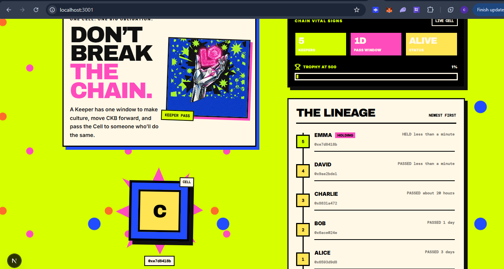
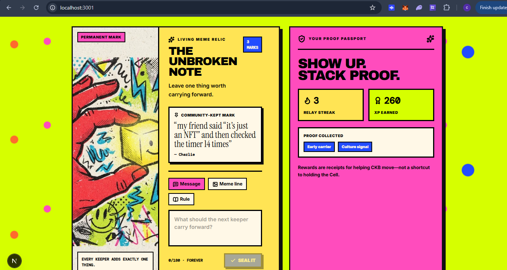

## CKB Builder Track Dev Log (Week 13)

- Name: Chioma Christopher
- Week ending: 27-07-2026
- Project: **Chain Letter** (Keepers Relay)
- Focus: **CKB Cell as a social collectible -- timed handoff, Keeper Pass, and community participation**
- Status: **Working Next.js frontend prototype with mocked CKB-style Cell lifecycle**

---

### What this week was about

Week 12 closed out FiberMeter for the Gone in 60ms hackathon. Week 13 was a
shift back toward **CKB’s Cell model as a product mechanic**, not only as an
implementation detail.

The spark for this project came from a conversation with a CKB community
member talking through my Interest. I want more of my builder-track work to grow out of community conversations like this, and going forward i'll be explorig and completing several ideas as I Keep exploring the ecosystem.

I began building **Chain Letter** (I should change this name though 🤔🤔): a
CKB-native social collectible where one unique Cell must be passed from Keeper
to Keeper before a deadline expires.

The Cell is scarce. The deadline is real. The handoff is public. The artifact is permanent. The Keeper gets a brief moment of authorship, while everyone else can build standing by helping the chain and the broader CKB community move forward.

If the current Keeper does not pass it in time:

**The Chain dies.**

The Cell becomes permanently locked and can never move again.

The idea guiding the product:

> A Cell can hold more than value. It can hold a promise.

This week I moved from protocol research and product architecture into
application design and frontend implementation. The current build is a
functional prototype: typed models, React Query, and an in-memory mock of the
CKB consume-and-create Cell handoff. Wallet, transaction, indexer, and on-chain
script layers are planned next.

---

### Goals for the week

- Define the Chain Letter product loop
- Translate the CKB Cell model into a user-facing experience
- Build the live Chain dashboard (countdown, urgency, lineage, death)
- Model the timed handoff flow
- Create meaningful Keeper-only privileges
- Add community participation beyond ownership
- Build CKB Relay and contribution Passport mechanics
- Design a visual identity that feels culturally distinct from a normal crypto dashboard
- Document the future CKB, wallet, and backend stack needed for production

---






### The Chain Letter idea

Chain Letter is one unique on-chain collectible.

Only one person can hold it at a time. That person becomes the current
**Keeper**.

The Keeper has a fixed time window (currently modeled as **24 hours**) to pass
the Cell to someone else.

The ownership chain looks like this:

```text
Alice
  ↓
Bob
  ↓
Charlie
  ↓
David
  ↓
Emma
```

Each successful handoff records the former Keeper and creates a new deadline for
the next person.

If Emma fails to pass the Cell before the timer ends:

```text
Chain Dead
Cell locked forever
```

This creates a social streak mechanic similar to Snapchat streaks, Duolingo
streaks, “don’t break the chain” habits, community relay games, and internet
chain-letter culture -- with one important difference:

The streak is represented by a **scarce CKB object** with a visible, auditable
ownership history. A long chain becomes valuable because many people
successfully coordinated to keep it alive.

---

### Why the CKB Cell model fits

The product maps cleanly to CKB because the Chain Letter is literally one Cell.

Ownership rules:

- One Cell exists
- One live owner controls it
- One valid transaction can consume it
- One successor Cell is created for the next Keeper

A successful handoff conceptually works like this:

```text
Consume current Chain Cell
          ↓
Validate current Keeper + deadline
          ↓
Create successor Chain Cell
          ↓
Assign new Keeper lock
          ↓
Set new expiry time
          ↓
Record next generation of the chain
```

That is cleaner than coordinating a shared mutable object across many users.

The Chain Cell becomes the source of truth for:

- Current Keeper
- Expiry timestamp
- Handoff window
- Chain generation / owner count
- Lineage commitment
- Artifact commitment
- Active Relay reference
- Alive or dead status

| Product requirement       | CKB primitive                                         |
| ------------------------- | ----------------------------------------------------- |
| Only one current Keeper   | One live Cell can be spent by one valid transaction   |
| Handoff changes ownership | Consume old Cell, create new Cell with new lock owner |
| Deadline enforcement      | Type script validates expiry and permitted transition |
| Permanent death           | No valid replacement Cell after expiry                |
| Immutable lineage         | Transactions / indexer reconstruct history            |
| Evolving artifact         | Commitments on-chain; rich content off-chain          |

---

## What I implemented this week

### 1. Live Chain Cell dashboard

I built the main dashboard around the live Cell:

- Animated Cell visual
- Current Keeper + Cell hash
- Live countdown timer
- Owner count and trophy progress toward **500 Keepers**
- Full Keeper lineage (newest first)
- Permanent dead-chain lock state

Urgency states:

| State        | Meaning                       |
| ------------ | ----------------------------- |
| Alive / safe | Meaningful time remaining     |
| Warning      | Clock is getting loud         |
| Critical     | Chain could break soon        |
| Dead         | Deadline expired; Cell locked |

The UI treats time as the emotional core of the product, not a small status chip.

### 2. CKB-style handoff flow

I built a transfer modal that models the intended CKB lifecycle:

1. Open handoff
2. Choose or enter the next Keeper
3. Confirm
4. Consume the current Cell (mark previous Keeper as passed)
5. Create a successor Cell for the recipient
6. Reset the expiry window

In the prototype this updates mocked in-memory state via React Query mutations.
In production it will:

1. Build a CKB transaction
2. Consume the current Chain Cell
3. Create a successor Chain Cell
4. Change the lock to the next Keeper
5. Reset expiry and commit lineage state
6. Ask the wallet to sign
7. Broadcast and wait for indexer confirmation

### 3. Keeper Pass privileges

Scarcity alone is not enough. Holding the Cell should feel like a temporary
role, not just an NFT.

The **Keeper Pass** gives the current holder:

#### Living Artifact

- Add one permanent mark: message, rule, or meme line
- Feature one community mark
- Grow a cultural record that outlives any single Keeper

#### Relay selection

- Choose the active **CKB Relay** (Learn / Explore / Create missions)
- Direct community attention toward useful ecosystem actions

#### Next Keeper nomination

- Review handoff queue pledges
- Endorse a candidate
- Open the pass flow with that person preselected

### 4. Community participation beyond ownership

Non-Keepers still have reasons to return:

- Complete the active Relay and earn XP / badges
- Build a Contribution Passport (streak, XP, proof)
- Join the handoff queue with a pledge
- Follow the artifact and lineage over time

This answers: _Why return if I do not hold the Cell today?_

### 5. Relay Board + Contribution Passport

Example Relays in the prototype:

- Decode one Cell (CKB Academy)
- Visit a digital object (Spore)
- Ship a signal (CKB Builders)

The Passport shows streak, contribution XP, and earned badges -- framed as
**receipts for useful participation**, not financial returns.

### 6. React Query architecture

I structured the frontend so it already behaves like an async product:

- Query keys for Chain + Keeper ecosystem state
- Typed queries for chain, artifact, Relay board, queue, Passport
- Mutations for pass / reset / fast-forward / publish / feature / activate /
  complete / join / endorse
- Cache updates, loading, pending, and error surfaces

That matters because production will coordinate wallet signing, RPC, broadcast,
indexer confirmation, off-chain storage, and partner verification.

## What exists now vs what must come next

### Exists in the prototype

- One live Chain Letter Cell (mocked)
- One current Keeper (seeded as Emma for demo privileges)
- 24h handoff window + live countdown
- Alive / warning / critical / dead states
- Simulated consume → create successor handoff
- Living Artifact, Relay Board, Handoff Queue, Passport
- Neo-brutalist UI

### Does not exist yet

- Real wallet identity
- Real CKB Cells / transactions
- Chain Cell Type Script
- RPC + Indexer connection
- Persistent database for social data
- Multi-page navigation / Relay proof flows
- Notifications, moderation, analytics

## Wallet integration plan (next)

1. Connect supported CKB wallet
2. Select account / lock script
3. Sign nonce-based login message
4. Map lock hash → profile + Passport
5. Confirm connected account matches live Chain Cell lock before Keeper controls
6. Build + simulate handoff transaction
7. Wallet signs → broadcast → indexer confirms
8. Invalidate Chain / lineage / artifact / Passport queries

Required UI honesty:

```text
Draft → Wallet approval → Broadcasting → Confirming → Confirmed / Failed
```

Never imply a handoff is final before indexer confirmation -- especially with a
live deadline ticking.

---

## Main lessons from this week

1. **CKB architecture can become a product mechanic.**  
   One Cell, one owner, one successor transaction naturally creates
   responsibility.

2. **Scarcity alone is not enough.**  
   The Keeper Pass adds authorship, mission selection, and social nomination.

3. **Non-holders need a reason to return.**  
   Artifact, Relay, Queue, and Passport solve the spectator problem.

4. **Ecosystem value must be intentional.**  
   Relays push attention toward useful CKB discovery, not empty engagement.

5. **Frontend state design matters before wallet integration.**  
   Typed APIs + React Query now leave a clear path to real network interactions.

---

## Key concepts applied

- CKB Cells (consume + create)
- Lock scripts and ownership
- Time-based state transitions / expiry
- Permanent lock / dead state
- Chain lineage
- Community-owned cultural artifacts
- Keeper roles
- React Query caching and async mutations
- Contribution reputation / Relay mechanics
- Neo-brutalist product design

---

## Next steps (Week 14+)

Near-term product foundation for Chain Letter / Keepers Relay:

- Real navigation (Chain detail, Relay hub/detail, Profile, How it works)
- Change **Do Relay** from instant XP to a real proof flow page
- Header navigation + placeholder wallet CTA

Then testnet alpha:

- Wallet connection and signed profiles
- Chain Cell Type Script + handoff transaction builder
- RPC + Indexer-backed Chain state
- Persistent artifact / queue / Passport data
- Deadline notifications and basic moderation

### Exploring more than one idea

Going forward, I will not treat this as my only track. As I keep exploring the
**CKB ecosystem**, I plan to pick up, prototype, and complete **several ideas** —
some from community conversations, some from docs and tools, some from gaps I
notice while building. Chain Letter is one living experiment in that wider
exploration, not the final destination.

### Closing

Chain Letter is not trying to make every CKB interaction feel like finance. It
gives the ecosystem a social object worth caring about — and it is one of the
ideas I will keep refining while I continue exploring more of CKB.

**Keep it alive. Leave a mark. Pass it on.**
