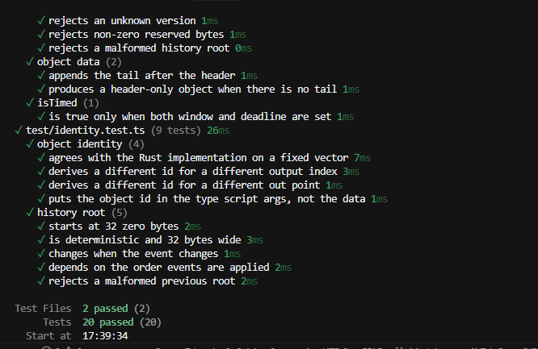
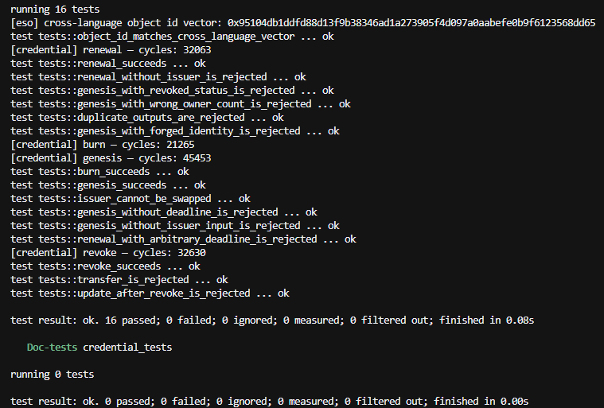

# CKB Builder Track Dev Log — Week 16

- Name: Chioma Christopher
- Week ending: 23-08-2026
- Project: Chain Letter / Keepers Relay
- Live app: [keepers-relay.vercel.app](https://keepers-relay.vercel.app)
- New repo: [evolving-stateful-object](https://github.com/Kaylahray/evolving-stateful-object)

---

Last week I said the next step was pulling the SDK out and writing a second object type to prove the
pattern generalises. That is what I did this week. It now lives in its own repo, separate from the
app, called Evolving Stateful Object.

But before any of that I found a real problem in my own work, and I want to write it down properly
because it changed what I built.

---

My Chain Cell type script was deployed with empty `args`. I did not think much about it at the time.
What it means is that every Chain Cell ever created shares the exact same type script. On CKB, a
script only ever sees the cells that share its script — that group is its whole world. So my script
had no way to tell one streak from another.

The `chain_id` I was writing into the cell data did not fix this. It looks like an id, but the script
never checked it was unique, and it could not have. Checking uniqueness would mean searching every
cell that exists, and a script cannot do that. So `chain_id` was only a claim. Anyone could mint a
cell carrying someone else's `chain_id` and my script would accept it. Two live cells, both saying
they are the same streak, and nothing on chain to say which is real.

That is the difference between an app that writes to CKB and an actual protocol. I had been calling
it the second thing while it was still the first.

---

The fix is the type-id pattern. Instead of putting the id in the data, the script derives it from the
first input the transaction spends, and requires its own `args` to equal that hash. An out point can
only be spent once, ever, so nobody can produce those args a second time. The id stops being a claim
and becomes a fact.

Two good things fall out of that. Every object gets its own group, so my cardinality check finally
means what I always said it meant, one live cell per object. And the whole history of an object
becomes readable from the chain by itself. You start at the live cell, walk backwards through the
transactions that made it, and you get every owner and every change without asking my server for
anything.

That last part matters to me because of the bugs I was fighting last week. The duplicate holder in
the lineage happened because the lineage lived in my server's memory and my code appended to it
twice. If the lineage comes from the chain, that class of bug cannot happen. The database goes back
to being a cache I can rebuild instead of the truth I can corrupt.

---

So the repo has four things in it.

The spec, which is the written convention. A 64-byte header, four transitions, and the identity
rule. Anyone can implement it in any language.

`eso-core`, a Rust no_std crate. It does the identity check, works out which of the four transitions
a transaction is, and enforces the rules that are the same for every object. If you want to build a
new object type you implement one trait and only write what makes yours different.

The TypeScript SDK, published as `evolving-stateful-object`. It encodes and decodes the header,
derives object ids, builds all four transactions, finds the live cell, and walks the lineage back to
genesis.

And a second object type as an example, a credential. I picked it on purpose because it is the
opposite of Chain Letter. It cannot be transferred at all, expiry is the point of it rather than a
detail, and the person who controls it is not the person holding it. It needed no changes to the
core. That is the actual evidence that the abstraction is doing something, not just one project with
extra folders.

---

There are 16 Rust tests and 20 TypeScript tests and they all pass. Two of them I care about.

One mints an object with forged args and checks the chain rejects it. That is the exact hole I had,
now closed and proven closed.

The other pins the same object id in both languages, `0x95104db1…dd65`, worked out separately by the
Rust side and the TypeScript side. If those two ever disagree it means my SDK is building
transactions the script will refuse, and I find out in tests instead of on testnet.

---

On Spore, since I keep getting asked.

Spore is for content that does not change. You mint it, you own it, you can move it or melt it. The
type script checks the content is valid and that you are the owner. That is the contract.

Take what Chain Letter needs and try to put it there. The deadline has to move forward by exactly one
window on every pass. You cannot pass it to yourself. Status can go from alive to returned and never
back. Ask where those rules would live in Spore. There is nowhere to put them, so they end up in your
app. And a rule that lives in your app is not a rule, it is a request. Anyone can build the
transaction by hand and ignore your app completely.

That is the whole thing. Spore standardises an object. This standardises how to define objects that
change.

---

What is left. Nothing is deployed yet, so the type script has no code hash. Next is deploying the new
script, then moving Keepers Relay onto the SDK so it uses the published package and nothing private.
That part matters more than it sounds. If my own app can run on only the public interface, then the
SDK is genuinely enough for someone else. If I have to reach around it, I have found a hole before
anyone else does.

Type-id changes the code hash, so this is a fresh deploy and existing streaks do not carry over. I
would rather take that now than after somebody builds on it.

**Keep it alive. Leave a mark. Pass it on.**
