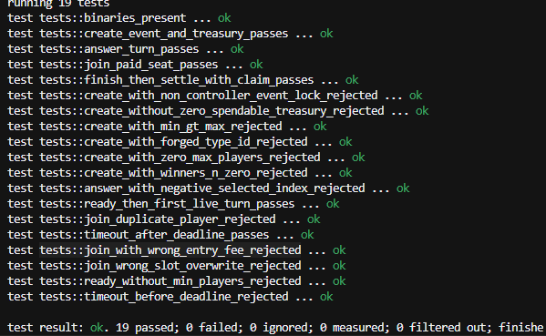

# Week 17 — Part 2

- Name: Chioma Christopher
- Week ending: 09-10-2026
- Project: Keepers Relay
- Live app: [keepers-relay.vercel.app](https://keepers-relay.vercel.app)
- Continues: [Week 17 Part 1](./week_17.md)

---

## Overview

Part 1 of Week 17 focused on product direction: one multiplayer event loop, and a CKB architecture that follows that loop.

Part 2 focused on implementation and verification.

This week I expanded the Event Engine test suite, fixed bugs the tests exposed, redeployed the corrected scripts on Pudge, updated the application environment to match those deployments, and improved the Connect authentication flow in the app.

Week 18 will focus on the SPARK grant proposal. This report covers the technical work completed in this second half of Week 17.

---

## 1. Event Engine transaction tests

At the start of Part 2, the four Event Engine scripts were already built and had been deployed on Pudge. The next step was to verify them with real CKB transactions, not only by compiling the binaries.

I replaced the earlier smoke tests with a `ckb_testtool` suite under:

```text
keepers_relay/scripts/event-engine/tests/
```

How to run (WSL):

```bash
cd …/scripts/event-engine
make build
make test
```

**Result: 19 tests passed.**

Coverage:

| Area | Coverage |
|------|----------|
| Create | Event Cell + treasury mint; Type ID checks; invalid create cases rejected |
| Join | Paid seat (Event + treasury growth + Participant); wrong fee, duplicate player, and slot overwrite rejected |
| Ready → Live | Ready blocked below minimum players; first live turn accepted |
| Answer | Valid answer turn accepted; invalid selected index rejected |
| Timeout | Timeout before deadline rejected; timeout after deadline accepted |
| Settle | Finish → settle with Reward Claim; treasury consumed |



The full transaction matrix is larger than these 19 cases. Expanding that matrix remains next-step work.

---

## 2. Bugs found in testing and the Pudge redeploy

The suite surfaced two script bugs. Both were fixed, retested, and redeployed.

### Treasury lock

The treasury script used `group_len(GroupOutput)` in a path where the group length could report `0` even when a matching treasury output existed. Update transactions were then treated as settle transactions.

**Fix:** count matching cells by lock hash on inputs and outputs.

### Event type

On `FINISHED → SETTLED`, treasury capacity moves into reward claims and the pot becomes zero. The join-delta check still ran on that transition and rejected the decrease.

**Fix:** skip join-delta validation on the settle transition.

### After the fixes

1. Rebuilt the Event Engine
2. Re-ran the suite — **19 passed**
3. Redeployed **event-type** and **event-treasury-lock** on Pudge (2026-09-10)
4. Left **participant-type** and **reward-claim-type** unchanged (2026-09-09 deployments)
5. Updated `.env.local` and Vercel (Production, Preview, Development) with the new code hashes

### Deployed scripts on Pudge (2026-09-10)

| Script | Status | Code hash (prefix) | Deploy tx (prefix) |
|--------|--------|--------------------|--------------------|
| event-type | Redeployed 09-10 | `0x1bc7dc32…` | `0x0cfe8508…` |
| event-treasury-lock | Redeployed 09-10 | `0xbd865152…` | `0xcff3a13f…` |
| participant-type | Unchanged since 09-09 | `0x60a14545…` | `0xa03f80ed…` |
| reward-claim-type | Unchanged since 09-09 | `0x40cc77e8…` | `0x33ba05cc…` |

Deployment record:

```text
scripts/event-engine/deployment/scripts.json
```

---

## 3. Protocol cleanup

Alongside the Event Engine work, I removed the old chain-cell / Living Relay script path from the application.

The MVP protocol surface is now:

- **event-type**
- **participant-type**
- **event-treasury-lock**
- **reward-claim-type**
- **protocol-common** (shared library, not deployed)

Turn state lives on the Event Cell. There is no separate turn-type or player-type script in the MVP.

---

## 4. Application updates

### Authentication

The Connect flow now covers wallet connection and session creation in one product action:

1. User selects **Connect**
2. Wallet opens if needed
3. User signs the Keepers Relay authentication message
4. Server sets the `kr_session` cookie
5. The profile chip appears once the session is authenticated

Create and join flows call `ensureAuth()` before protected actions.

### On-chain create and join

With Event Engine environment variables configured:

- **Create** mints the Event Cell and Treasury, then stores the cell references through the API
- **Join** (host path) updates the Event, grows the treasury, and mints a Participant cell

Gameplay answers continue through the application layer for speed. Timeout and turn advancement are intended to run through a relayer/controller so each answer does not require a wallet signature.

Current join behaviour:

- Host path can complete the paid on-chain seat
- Other players can join the lobby in the application
- Independent paid on-chain join for every player is the next protocol milestone

Target end-to-end flow on Pudge:

```text
Create
  ↓
Paid join
  ↓
Live turns
  ↓
Timeout
  ↓
Settle
  ↓
Reward claim
```

---

## 5. Completed this week

- Event Engine integration tests — **19 passed**
- Treasury lock and event-type settle bugs fixed
- `event-type` and `event-treasury-lock` redeployed on Pudge
- Local and Vercel environment variables updated
- Chain-cell path removed from the app
- Unified Connect authentication
- Create and join builders connected when Event Engine env is set
- Project handoff notes updated in `keepers_relay/context.md`

## 6. Next steps

1. Paid on-chain join for all players
2. Settlement and reward-claim UI
3. Relayer service for timeout and turn advancement
4. Stronger API verification of on-chain seats
5. Broader coverage from `TRANSACTION_CASES.md`
6. Week 18: SPARK grant proposal write-up

---

## 7. Architecture note for the grant work

The layering that will guide the grant proposal is:

| Layer | Responsibility |
|-------|----------------|
| Frontend | User experience, discovery, play, creator flows |
| Backend | Coordination, sessions, lobby, questions, relayer operations |
| Scripts | Ownership, funds, proofs, settlement |

The Event Engine pattern is:

```text
Current State → Authorized Action → Validation → New State → Settlement
```

The current four scripts are the foundation for the next milestone. Additional scripts are not required until that lifecycle is complete in the live application.

---

## Closing

Week 17 Part 1 defined the product and protocol direction.

Week 17 Part 2 verified the Event Engine with transaction tests, fixed the failures those tests found, redeployed the corrected scripts on Pudge, and aligned the application with the new deployments.

The next phase is completing the full event lifecycle in the live app on testnet, then packaging that progress into the SPARK grant proposal in Week 18.

**Live app:** [https://keepers-relay.vercel.app](https://keepers-relay.vercel.app)
