## CKB Builder Track Dev Log (Week 2)

- Name: Chioma Christopher
- Week Ending: 03-05-2026

#### Courses Completed

- Read through the entire CKB Scripts section of the documentation — covering Script structure (`code_hash`, `hash_type`, `args`), Lock vs Type Scripts, execution rules, syscalls, return codes, source constants, cycle limits, VM versions (0, 1, 2), Type ID for upgradable scripts, and Spawn/IPC with `ckb-script-ipc`.
- Went through the debugging and testing sections — `ckb-debugger`, GDB + VSCode step-through, flamegraph profiling, native simulator, UTXO-mindset test design, test matrix thinking, and fuzzing CKB scripts.
- Completed the full CKB JavaScript path documentation — from hello world with `ckb-debugger`, to building and testing TS contracts, the JS API (QueryIter, load functions, molecule, spawn/IPC), security best practices, and the simple file system for modular on-chain scripts.
- Did hands-on practice with the username registry and profile registry apps — claiming, burning, and reclaiming username cells, creating and destroying profile cells, and observing how the CKB cell model reflects all of this in real time on-chain.

---

## Practice

Here I had already claimed the username before. You can see it's already registered on-chain and linked to my  other wallet.

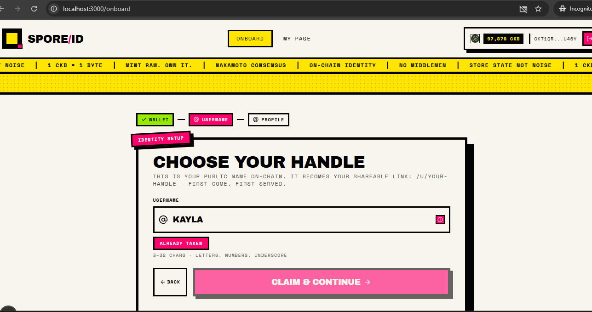
*This is the dashboard showing my previously claimed username. The username cell exists on-chain, meaning it's stored as a live cell with my lock script as the owner.*

---

I'm switching to a different username — one I also claimed before but burned afterwards.

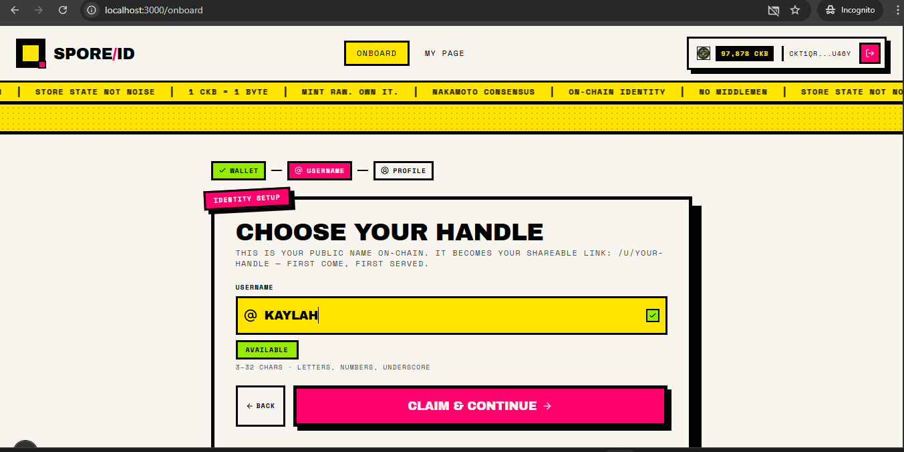
*Here I'm selecting a different username to claim. Even though I burned it earlier (which destroyed the cell and returned the CKB), I can reclaim it as long as no one else has taken it.*

---

After claiming the name, it takes me to the next page where I set my profile info.

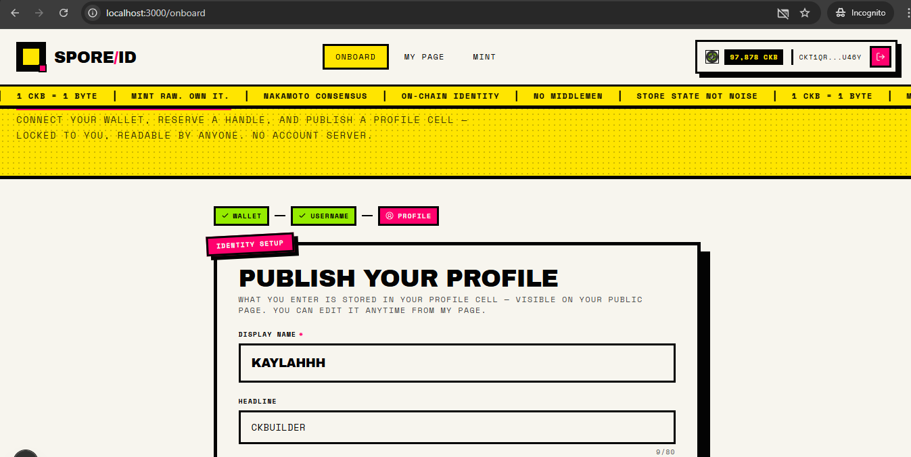
*This is the profile setup page. After a username cell is successfully created on-chain, the app routes me here to fill in my profile details before creating a profile cell.*

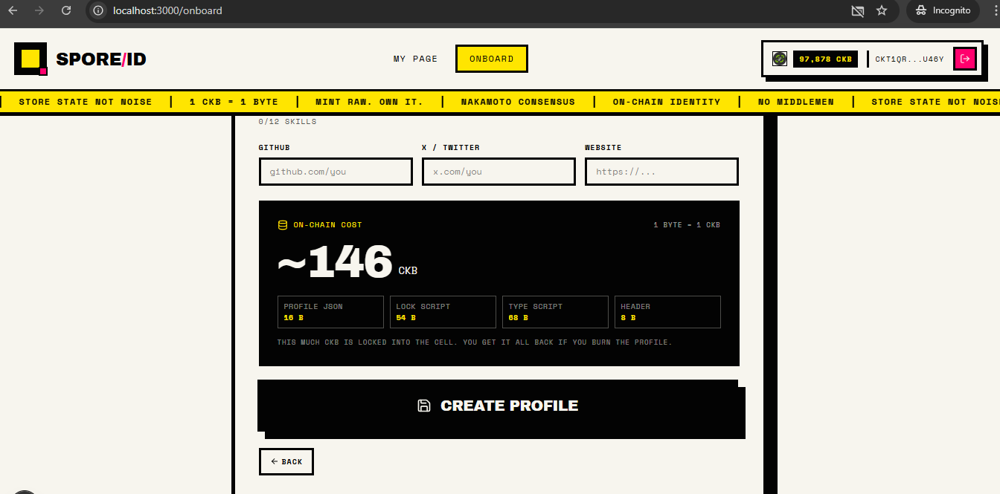
*Filling in my profile info — this data will be stored in the `data` field of the profile cell on-chain.*

Then I click "Create Profile."

---

This is what it shows when you burn your username cell but not the profile cell.


*Interesting edge case — when I burn only the username cell, the profile cell still exists on-chain, but the app can't resolve who the username belongs to anymore. The UI reflects this broken state.*

---

I'm claiming it back.

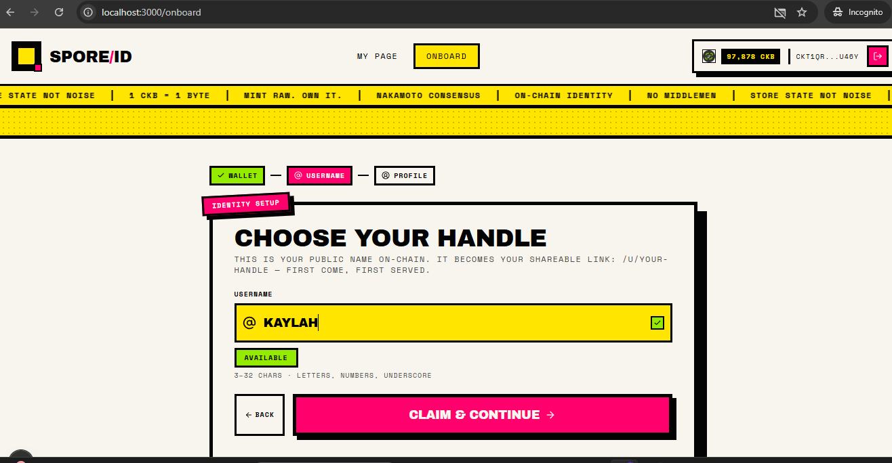
*Reclaiming my username by submitting a new transaction that creates a fresh username cell with the same name. The blockchain doesn't block this since the old cell was already consumed (burned).*

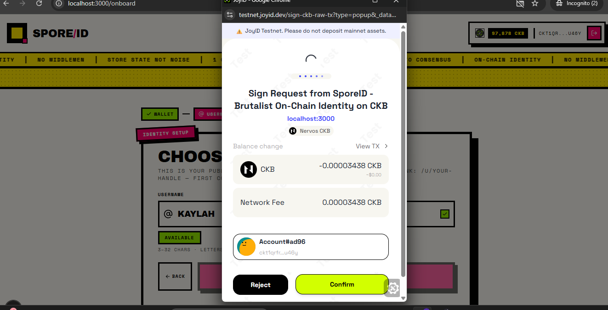
*The transaction is being built and submitted. Under the hood, this creates a new cell with my username stored as hex-encoded bytes in the `data` field.*

---

After claiming my name back, I can see it alongside my profile cell. Now I can access my profile page.

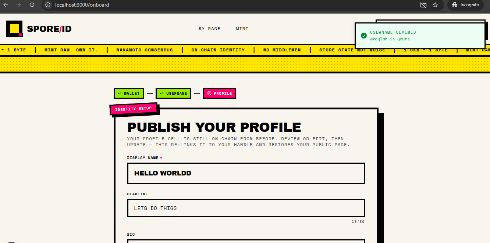
*Both cells are now live — the username cell and the profile cell. The app resolves them together to display my full profile.*

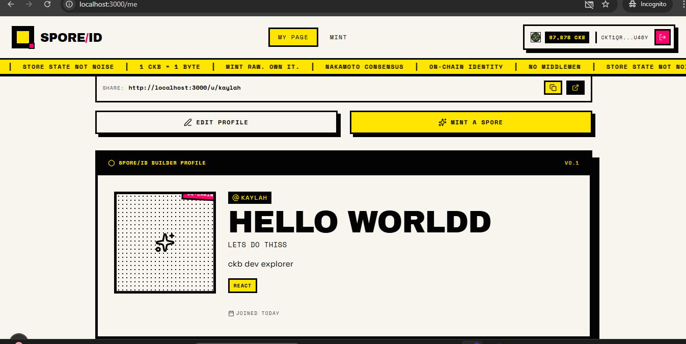
*My profile page is accessible again. This works because the app queries my username cell, finds the matching profile cell, and renders the data stored in both.*

---

What if I want to burn my profile cell?

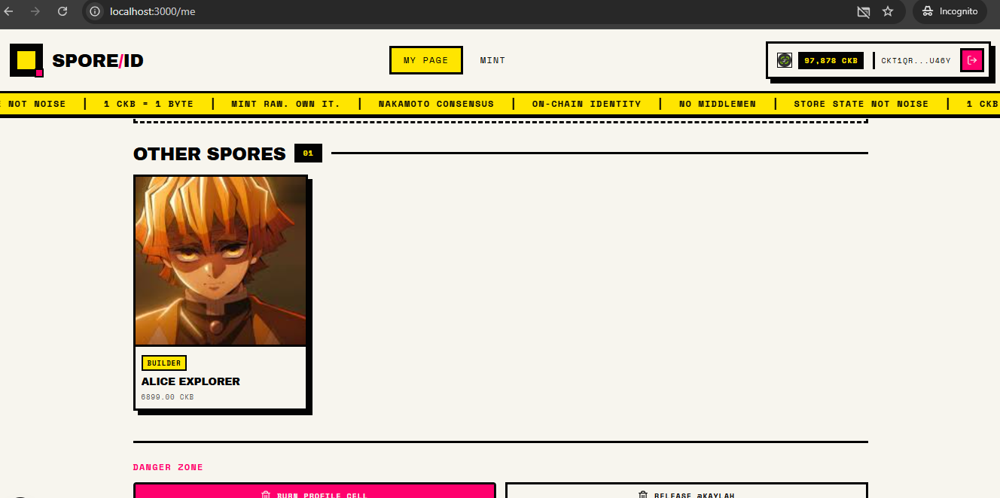
*I'm initiating a burn on the profile cell specifically. Burning a cell means using it as an input in a transaction without a corresponding output — it gets consumed and the locked CKB is released back to me.*

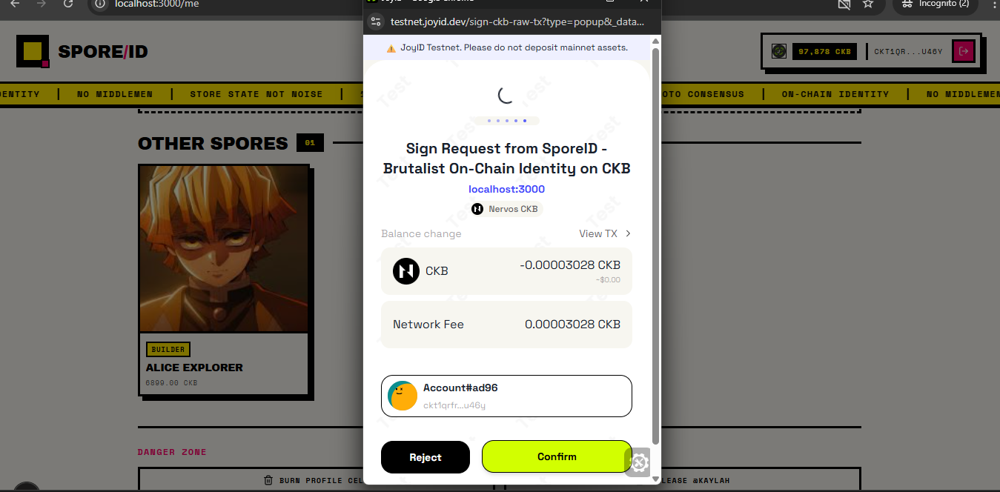
*Confirming the burn transaction. At this point, the profile cell will be permanently destroyed once the transaction is committed.*

After the burn:

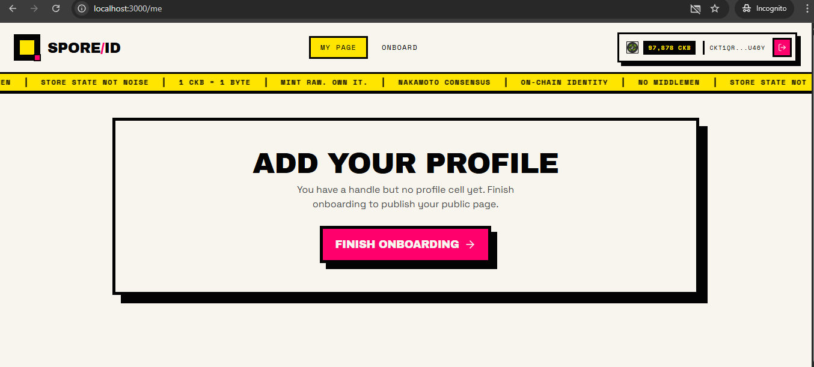
*The profile cell is gone, but my username cell is still live. The app shows a state where I have a username but no profile — similar to the earlier broken state, but in reverse.*

---

Creating a new profile cell.

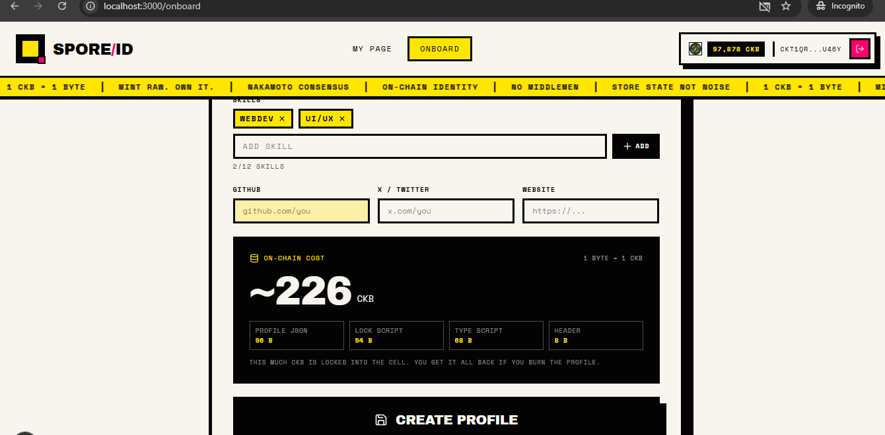
*I'm going through the profile creation flow again. Since cells are immutable, "updating" a profile actually means burning the old one and creating a new one — but here I'm just creating fresh since I already burned it.*

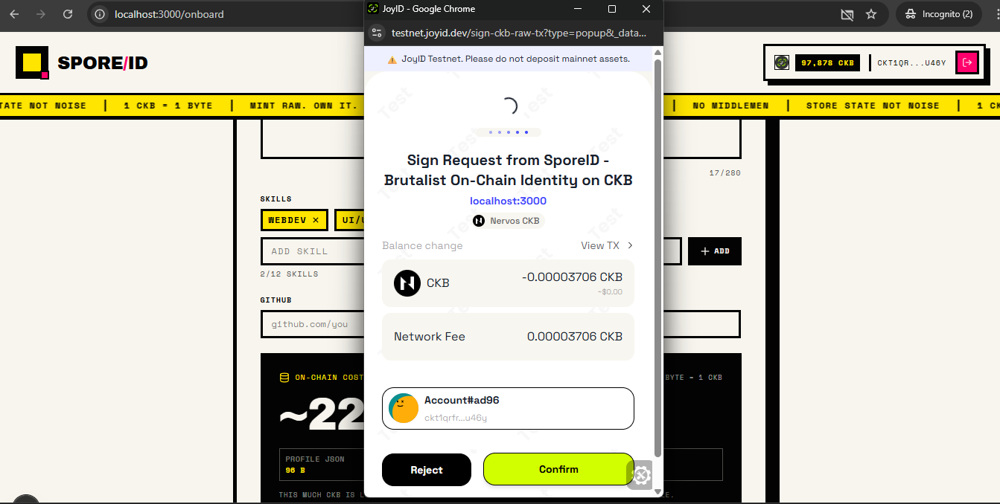
*The transaction is being submitted to create the new profile cell on-chain.*

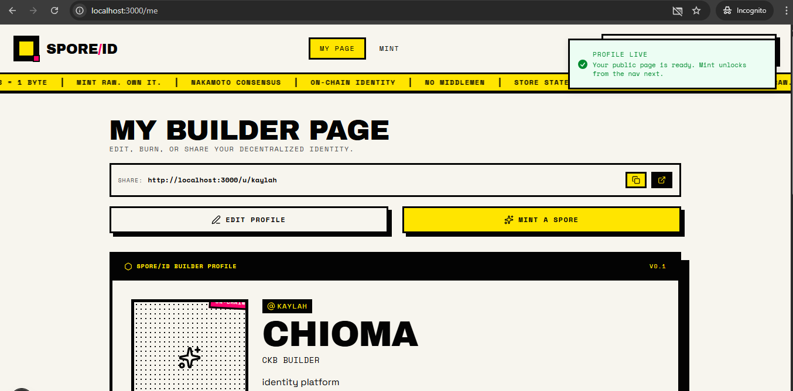
*Transaction confirmed. A new profile cell now exists on-chain with my updated data.*

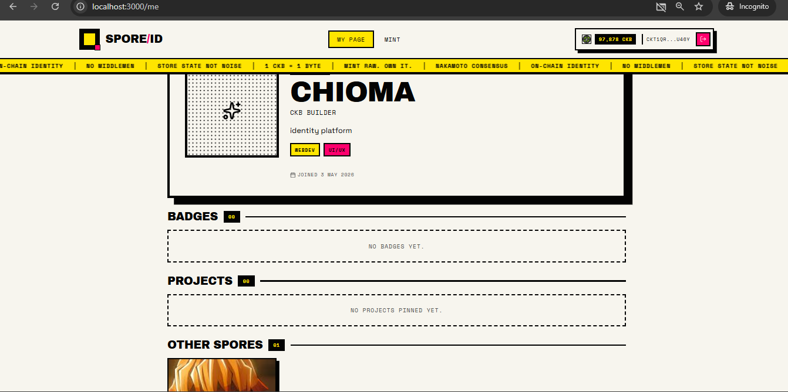
*Back to the normal state — username and profile cells are both live, and my profile page is accessible again.*

---

This is a burn transaction. When I checked the "Data" tab after clicking "Cell Info," it shows what I burned — which is my username stored in hex.

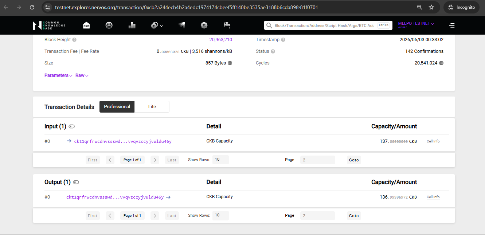
*The raw cell data shown in hex. Every username is stored as bytes in the `data` field of the username cell. You can decode it to get the original string.*

This decodes to "kaylah." Also notice that when I burn cells, I get my CKB back.

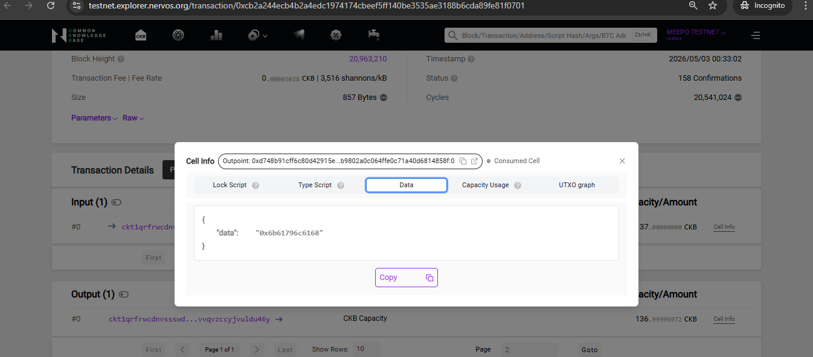
*Decoded hex = "kaylah" — that's my username. And because burning destroys the cell, the CKB that was locked in it (to cover cell capacity) gets returned to my wallet. This is a key mechanic in CKB — you pay to store data, and you get paid back when you delete it.*

---

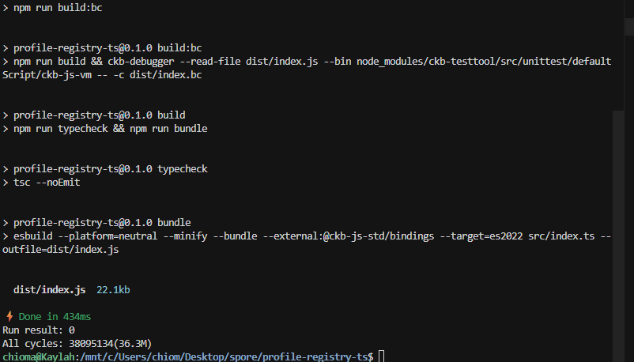
*Continuing to explore the app flow — testing various states to understand how the username and profile cells interact.*

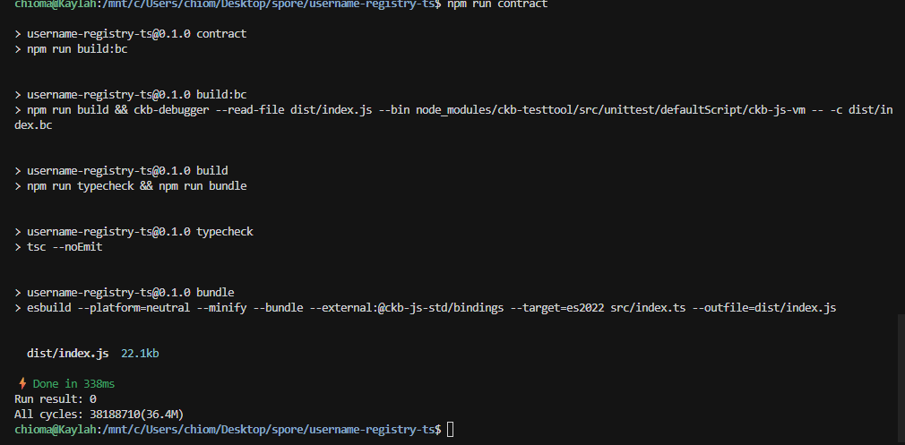
*Each action here corresponds to an on-chain transaction. Even small UI interactions like "claim" or "burn" are real blockchain operations.*

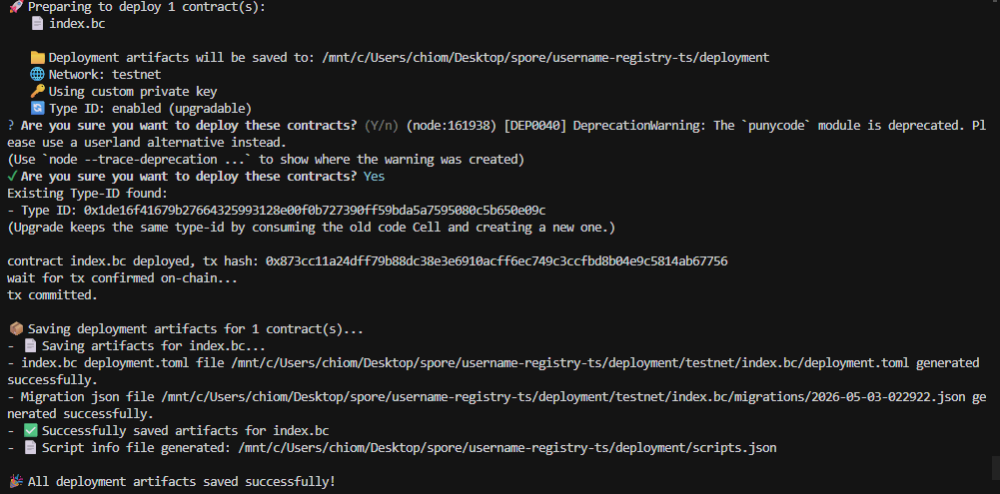
*The app correctly reflects the on-chain state in real time, querying the CKB node to check which cells are live.*

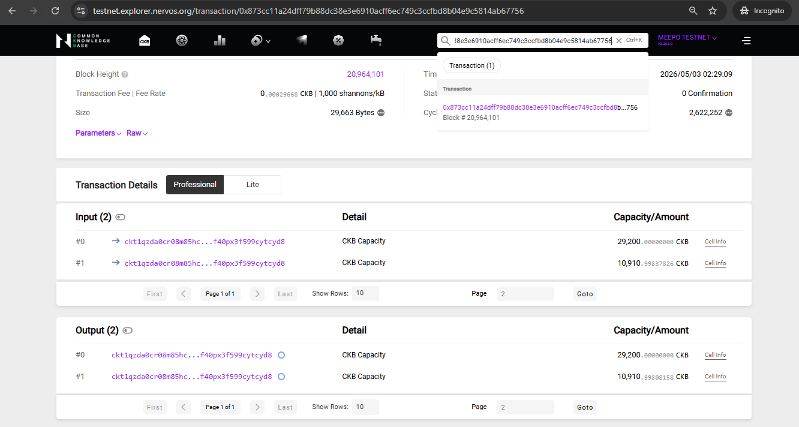
*Final state of my testing session. Everything behaves as expected — claim, set profile, burn, reclaim, repeat. The cell model makes all of this composable and reversible.*

THEORY 
## 1. Intro to Script

### What I learnt

A Script in Nervos CKB is a binary executable that runs on-chain.
That means it is a program stored in a form the blockchain can execute.
It is Turing-complete, which means it can do very flexible logic, not just a few fixed checks.
I can think of a CKB Script like a smart contract, but in CKB it is more accurate to think of it as an executable program used to validate rules around Cells and transactions.

---

## 2. How a Script Works

### What I learnt

When CKB runs a Script, it does not run it directly on the node machine.
Instead, it runs inside a virtual machine called CKB-VM.
If the program finishes and returns `0`, the Script passes.
If it returns any other number, the Script fails.
When I submit a transaction, CKB runs all related Scripts in that transaction.
If even one Script fails, the whole transaction is rejected and will not go on-chain.
This is how different Cells can enforce different rules.

---

## 3. Script Types

### What I learnt

There are two main Script types in CKB:

1. **Lock Script**
2. **Type Script**

Lock Script controls ownership and access to a Cell.
Type Script controls how a Cell is allowed to be used or changed in a transaction.

The big execution rule I need to remember is this:

- Input Cells' Lock Scripts are executed.
- Input Cells' Type Scripts are executed.
- Output Cells' Type Scripts are executed.
- Output Cells' Lock Scripts are **not** executed.

Because of that difference, Lock Scripts are usually about _"who can unlock or spend this Cell?"_ and Type Scripts are usually about _"what state changes are allowed for this Cell?"_

---

## 4. Script Structure

### Structure

```rust
pub struct Script {
    pub code_hash: H256,
    pub hash_type: ScriptHashType,
    pub args: JsonBytes,
}
```

### What I learnt

Each Script has three main parts:

- `code_hash` tells CKB which Script code to use.
- `hash_type` tells CKB how to interpret that hash when locating the code.
- `args` gives extra parameters so the same code can behave differently for different users or situations.

Together, `code_hash` and `hash_type` tell CKB where the actual executable code is.

---

## 5. code_hash + hash_type

### What I learnt

CKB can locate script code in different ways.
If `hash_type` is `data`, `data1`, or `data2`, CKB matches the hash directly against the binary data.
If `hash_type` is `type`, CKB matches the hash against a Cell's Type Script hash instead.
So the pair `code_hash + hash_type` is basically the address rule for finding the executable.

---

## 6. Why args Matter

### What I learnt

The `args` field is what lets many different Scripts reuse the same underlying code.
For example, many users may use the same default Lock Script code.
But each user can put a different public key hash inside `args`.
So the code stays shared, while the actual Script instance becomes user-specific.

---

## 7. Program Languages for Script

### What I learnt

CKB-VM is based on RISC-V, so a CKB Script behaves more like a normal executable program than a contract written for a special VM-only language.
In theory, I can use any programming language if I have the right toolchain.
In practice, Rust is the recommended choice right now because the CKB ecosystem around Rust is the most complete.

---

## 8. Rust on CKB

### What I learnt

Rust is recommended because it is fast, memory-safe, and already heavily used in core CKB development.
That matters because Scripts often do expensive or security-sensitive work like:

- signing
- hashing
- big number operations

Better performance means fewer cycles consumed.
Memory safety is also important because Script bugs can affect assets.

Useful Rust tools mentioned in the docs:

- `ckb-std`
- `ckb-testtool`
- `ckb-script-templates`

---

## 9. C on CKB

### What I learnt

C can also be used to write CKB Scripts.
The idea is to compile C code into RISC-V binaries using GCC or related tooling.
This approach has already been used for production-style scripts like sUDT and xUDT.
So C is a valid lower-level option, especially if I want tight control or I am already comfortable with C.

---

## 10. JavaScript on CKB

### What I learnt

JavaScript cannot be compiled directly into native RISC-V instructions for CKB the same way Rust or C usually is.
Instead, JavaScript runs through an interpreter.
On CKB, that support is provided by `ckb-js-vm`, which is built on QuickJS.
To improve performance, common crypto operations are implemented in C.
Even with that, JavaScript is still slower than compiled languages because interpretation adds overhead.

So JS is useful for:

- learning
- prototyping
- demos
- quick tooling

---

## 11. Lua on CKB

### What I learnt

Lua is also supported through an interpreter, using `ckb-lua-vm`.
Like JavaScript, the interpreter is deployed first, and then the Lua code runs on top of it.
This is less performant than compiled languages, but Lua is lightweight and simple.

---

## 12. Other Languages Too?

### What I learnt

Yes. Since CKB-VM acts like a small computer, many languages are possible.
The general pattern is:

1. deploy a language-specific runtime or dependency
2. run the language program on top of it

That means things like Ruby, Bitcoin Script, or even EVM-style execution can be brought onto CKB if their VMs are compiled and deployed.

---

## 13. VM on Top of VM

### What I learnt

At first this sounds slow: one VM running inside another VM.
But the docs make an important point: I should not assume performance is bad without benchmarks for the real use case.
So the honest answer is: **it depends**.
Performance has to be judged with actual workloads, not guesses.

---

## 14. Script-Dedicated Language

### What I learnt

If I want something closer to Solidity-style development, there is a dedicated language called `Cell-Script` made by the CKB community.
It is still early, so it is more experimental than the main Rust path.

---

## 15. Invoke Scripts via Syscalls

### What I learnt

Syscalls are special low-level functions that let a Script talk to the CKB-VM environment.
Using syscalls, a Script can:

- exit
- read transaction data
- read cells
- read headers
- read witnesses
- load code
- debug
- spawn other script processes
- communicate through pipes

So syscalls are basically the bridge between my Script code and blockchain execution data.

---

## 16. Important Syscalls I Noticed

### What I learnt

Some important syscall groups from this section are:

- `ckb_exit`: stop execution and return a code
- `ckb_load_*`: read blockchain or transaction data
- `ckb_debug`: print debug messages
- `ckb_spawn`: start another script process and come back later
- `ckb_wait`: wait for a spawned process to finish
- `ckb_pipe`, `ckb_read`, `ckb_write`, `ckb_close`: process communication tools

This makes CKB Scripts feel closer to small operating-system programs than traditional smart contracts.

---

## 17. Return Codes

### What I learnt

Return codes are standard result numbers used by syscalls.
The main one is `CKB_SUCCESS = 0`.
Others tell me what went wrong, such as:

- index out of bounds
- item missing
- buffer too small
- invalid data
- invalid file descriptor
- other pipe end closed

So these constants are the standard error language between my Script and the VM.

---

## 18. Source Constants

### What I learnt

Source constants tell a syscall where to look inside the transaction.
Examples:

- `CKB_SOURCE_INPUT` -> all input cells
- `CKB_SOURCE_GROUP_INPUT` -> only input cells using the same current script
- `CKB_SOURCE_OUTPUT` -> all output cells
- `CKB_SOURCE_GROUP_OUTPUT` -> only output cells using the same current script
- `CKB_SOURCE_CELL_DEP` -> dep cells
- `CKB_SOURCE_HEADER_DEP` -> header deps

The word `GROUP` is important because it narrows the scope to cells that share the currently running Script.

---

## 19. Cell, Header, and Input Fields

### What I learnt

These constants let a syscall ask for one exact field instead of loading a whole object.
For Cells, I can ask for things like:

- capacity
- data hash
- lock script
- lock hash
- type script
- type hash
- occupied capacity

For headers, I can ask for epoch-related values.
For inputs, I can ask for the out point or since value.
This is more precise and efficient than always loading everything.

---

## 20. Spawn Example - Big Picture

### What I learnt

The spawn example shows one Script calling another Script like a child process.
The caller creates communication pipes, starts the callee with `ckb_spawn`, sends data, closes the output side, reads the reply back, and checks that the returned data matches what was expected.
So this is not just _"run another script"_.
It is closer to process creation plus inter-process communication.

---

## 21. My Simple Summary

What I understand so far is that CKB Scripts are executable programs used to validate transaction rules around Cells.
They run inside CKB-VM, and success means returning `0`.
Lock Scripts are mainly about ownership, while Type Scripts are mainly about allowed state changes.
Scripts are identified using `code_hash` and `hash_type`, and customized using `args`.
Rust is the main recommended language, but many other languages are possible because CKB behaves like a mini-computer.
Syscalls are the low-level interface that let Scripts read blockchain data and interact with the VM.
The spawn example shows that CKB can even support process-like behavior between scripts.

---

## 22. What I Still Want to Learn Next

- the exact difference between dep cells and normal cells in practice
- how `GROUP_INPUT` and `GROUP_OUTPUT` are used in real lock/type scripts
- the callee side of the spawn example in detail
- what `code_hash`, `type hash`, and `data hash` look like in real transactions
- how a basic Rust CKB Script is structured from project setup to deployment

---

## 23. Regulate Scripts via Cycle Limits

### What I learnt

CKB uses cycle limits to prevent scripts from abusing computation, like infinite loops.
Every VM instruction and syscall consumes cycles.
At block level, CKB checks total script cycles in that block.
If total script cycles exceed the consensus limit, the block is rejected.
This is a core safety and liveness rule for the network.

---

## 24. max_block_cycles Rule

### What I learnt

`max_block_cycles` is a hard consensus field in chain spec.
Mainnet Mirana value mentioned is `3,500,000,000`.
Important: there is no strict per-script or per-transaction hard cap in this model.
A script can consume many cycles as long as the whole block still stays under `max_block_cycles`.

---

## 25. Cycle Measures and Cost Model

### What I learnt

Cycle costs are designed from practical performance assumptions:

- RISC-V instruction costs are based on hardware behavior
- syscall costs are benchmarked from runtime performance

Initial ELF loading costs `0.25` cycles per byte (rounded up).
Most instructions cost `1` cycle, but branches, memory loads/stores, mul/div, and syscalls cost more.
`ECALL/EBREAK` have a base cost of `500`, and syscall byte transfer adds extra cost.

---

## 26. B Extension and MOP Fusion

### What I learnt

VM v1 adds RISC-V B extension instructions, each with 1 cycle.
CKB also supports MOP Fusion, where certain instruction sequences are fused.
The fused cost is effectively the max meaningful cost from the merged pattern, improving efficiency.
VM v2 adds more MOPs like `ADCS`, `SBBS`, and `ADD3*` patterns.

---

## 27. Spawn-Related Cycles in VM v2

### What I learnt

Spawn syscalls in VM v2 have extra constants:

- `SPAWN_EXTRA_CYCLES_BASE = 100_000`
- `SPAWN_YIELD_CYCLES_BASE = 800`

So `spawn`, `pipe`, `read`, `write`, `wait`, and related operations are intentionally costed higher than plain syscalls.
Switching VM instantiation states also consumes the extra spawn base cycles.

---

## 28. VM Selection by hash_type

### What I learnt

CKB has multiple VM versions, and script group execution version is chosen based on `hash_type`.
Mapping shown in docs:

- `data (0)` -> VM 0
- `data1 (2)` -> VM 1
- `type (1)` -> VM 2
- `data2 (4)` -> VM 2

So `hash_type` is not only about script lookup style, it also affects VM version selection behavior.

---

## 29. Determinism vs Upgradability Tradeoff

### What I learnt

If I use data-hash style, I get stronger determinism for the exact code version.
If I use type-hash style, I can follow upgrades more easily, but behavior can change after upgrades.
This is a design choice for dApp developers:

- deterministic pinning (`data/data1/data2` path)
- upgrade tracking (`type` path)

---

## 30. VM Version History (0, 1, 2)

### What I learnt

VM0 is genesis baseline.
VM1 (Mirana) adds B extension, MOPs, and new syscalls like VM version/current cycles/exec.
VM2 (Meepo) adds more MOPs and spawn-related syscalls.
Known issue highlighted: `exec` in VM1 is deprecated and not recommended.

---

## 31. Type ID for Upgradable Scripts

### What I learnt

Type ID is a pattern to create a unique and upgradable code cell identity.
Core idea: ensure only one live cell can have that exact type script identity.
Then scripts can reference code via that unique type hash, letting data/code update while identity remains stable.
This solves the _"data hash changes after upgrade"_ problem.

---

## 32. Why Uniqueness Matters (Attack Lesson)

### What I learnt

If Type Script identity is not truly unique, attackers can craft a different cell with the same type script and different code.
Then callers using type-hash reference might accidentally execute the wrong dep cell code.
So unforgeable uniqueness is mandatory for safe upgradable references.

---

## 33. Type ID as Genesis Script

### What I learnt

Type ID was implemented as a special genesis script by CKB team.
Reason: if it were purely ordinary upgradable code, recursive dependency issues appear.
Special Type ID hash is represented by hex of ASCII `TYPE_ID`.

---

## 34. Recommended Upgrade Workflow (Type ID + Lock)

### What I learnt

Best practice flow:

1. Initial deploy with Type ID + manageable lock (often multisig)
2. Upgrade iteratively while code matures
3. Final freeze by changing lock to an unlockable/frozen policy

So Type ID gives upgrade capability, and Lock Script decides practical mutability at each phase.

---

## 35. Spawn and IPC Big Picture

### What I learnt

Spawn (Meepo era) allows direct cross-script process-style calls while preserving parent context.
This is different from `exec`, which replaces current context.
Spawn + pipe syscalls create IPC-style communication between script processes in one transaction context.

---

## 36. Process and FD Model in Spawn

### What I learnt

Each running script acts like a process in CKB-VM terms.
Process IDs are unique and increasing.
Pipes create read/write file descriptor pairs for communication.
FDs can be passed to children through spawn, then used via `inherited_fds`.
Resource limits exist (process count, instantiated VM count, FD count).

---

## 37. ckb-script-ipc Library

### What I learnt

Implementing raw IPC by hand is hard (interface design, serialization, dispatch, error paths, response handling).
`ckb-script-ipc` simplifies this and supports Rust, C, and JavaScript/TypeScript.
Current limitation: automatic client call generation is strongest in Rust.
Since no true parallel concurrency exists here, model is clear client/server request-response.

---

## 38. IPC Wire Format (Request/Response)

### What I learnt

Packets use VLQ-encoded numeric headers for compactness.
**Request fields:**

- version (VLQ)
- method_id (VLQ)
- length (VLQ)
- payload

**Response fields:**

- version (VLQ)
- error_code (VLQ)
- length (VLQ)
- payload

Default payload serialization is JSON via Serde, but other Serde-capable formats can be used.

---

## 39. Spawn IPC Functions I Should Remember

### What I learnt

Core functions:

- `spawn` / `spawn_cell`
- `pipe`
- `read`
- `write`
- `close`
- `wait`
- `process_id`
- `inherited_fds`

Common spawn-related errors:

- wait failure
- invalid fd
- other end closed
- max spawned VMs
- max FDs created

`OtherEndClosed` is useful to implement `read_all` style behavior.

---

## 40. Batch 2 Personal Summary

In this batch, I learnt the control plane of CKB scripting.
Cycles are the economic and safety guardrail.
VM version selection depends on `hash_type`, so choosing data-hash vs type-hash affects determinism and upgrade behavior.
Type ID gives the unique identity trick needed for secure upgradable code references.
Spawn + pipes enable practical IPC-style script composition, and `ckb-script-ipc` makes this significantly easier to build.

---

## 41. Debugging Scripts with ckb-debugger

### What I learnt

`ckb-debugger` is the main off-chain debugging tool for CKB scripts.
I can run transaction scripts locally, inspect cycle usage, replace binaries, and debug failures.
It supports modes like full/fast/gdb/probe and has flags for script group, cell index/type, max cycles, and tx dump file.
So this is my first tool when a script behaves differently than expected.

---

## 42. GDB and VSCode Debug Flow

### What I learnt

For step-by-step debugging, I can run `ckb-debugger` in gdb server mode and connect with RISC-V GDB or LLDB-based tools in VSCode.
I should keep a stripped runtime binary for execution and a `.debug` binary with symbols for debugging.
This gives breakpoints and call stack visibility close to normal systems programming workflows.

---

## 43. Profiling with Flamegraph

### What I learnt

`ckb-debugger` can produce profiling data (`--pprof`).
Then `inferno-flamegraph` can turn it into SVG flamegraph.
This helps me see which script paths consume most cycles/time and where optimization effort should go.

---

## 44. Native Simulator

### What I learnt

Native simulator lets me debug script logic on host platform while simulating CKB syscall behavior.
It improves dev speed and IDE debugging comfort, especially for code not tightly tied to real VM execution.
But it is a simulation, not exact on-chain reality, so final validation should still include real CKB-VM style runs.

---

## 45. Choosing Debug Method

### What I learnt

`ckb-debugger + VSCode` gives higher compatibility with real execution.
Native simulator gives faster iteration and richer host debugging tools.
So my practical rule is:

- maintenance/stability focus -> debugger-first
- heavy active development -> simulator-first, then debugger confirmation

---

## 46. Common Error Codes I Should Memorize

### What I learnt

Core CKB errors include:

- index out of bound
- item missing
- length not enough
- invalid data
- wait failure
- invalid fd
- other end closed
- max VMs spawned
- max FDs created

Molecule parsing has its own error constants too.
Spawn read/write/wait combinations can deadlock; VM may terminate with internal error in such states.

---

## 47. Script Testing Guide (UTXO Mindset)

### What I learnt

CKB testing starts from transaction shape, not function call style like EVM.
I need to design test transactions across Inputs/Outputs/CellDeps and script grouping behavior.
**Grouping rule reminder:**

- input lock/type execute
- output type executes
- output lock does **not** execute

So test design must target group behavior, not just single-cell happy path.

---

## 48. Test Matrix Thinking

### What I learnt

For Type Scripts, I should test combinations like:

- 1->0, N->0
- 1->1, 1->N
- N->1, N->N
- 0->1, 0->N (mint/create patterns)

For Lock Scripts, focus on input-side cases because output locks are not executed.
I should include failure cases, edge sizes, and cycle-heavy scenarios.

---

## 49. Contract API-Based Test Design

### What I learnt

I should derive test cases from the script API/data model.
**Example from sUDT style logic:**

- args can encode owner/admin semantics
- data can encode balances
- tests verify conservation and permission rules

This gives cleaner and complete tests than ad-hoc transaction examples.

---

## 50. Fuzzing CKB Scripts - Why It Matters

### What I learnt

Unit/integration tests are human-designed and can miss weird paths.
Fuzzing feeds random/mutated inputs and looks for crashes, UB, panics, and bad memory behavior.
For scripts that parse witness/args/data, fuzzing is very valuable against malformed or malicious payloads.

---

## 51. Practical Fuzzing Workflow

### What I learnt

Recommended approach:

1. build initial corpuses (often from unit-test mock tx dumps)
2. run time-boxed fuzzing in CI (ex: 30-60 mins)
3. run longer 24/7 fuzzing on dedicated machines for mature/high-value scripts

If fuzzers find serious issues, increase fuzzing resources and diversify engines.

---

## 52. Fuzzing Engines and Corpus Formats

### What I learnt

Toolkit supports multiple engines (like libFuzzer, honggfuzz, AFL++).
Different engines explore space differently, so combining them can improve bug discovery.
Corpus formats include protobuf-style structure-aware modes and data-provider style approaches.
Structured corpuses often improve efficiency over pure random bytes.

---

## 53. Fuzzing Lessons from Real Cases

### What I learnt

Fuzzing often surfaces:

- panic/unwrap paths
- oversized allocation attempts
- unchecked parsing assumptions
- null/invalid pointer style issues
- buffer length misuse

Some findings are _"safe in CKB context but bad practice"_, and some are real exploitable risks.
So I should still fix both classes when possible to harden quality.

---

## 54. Assert Return Code or Not in Fuzzing

### What I learnt

Many fuzz setups rely mainly on sanitizers rather than asserting exact return values.
Asserting non-zero can create false positives when random input accidentally becomes valid.
A strong case for return-value assertions is differential testing between two implementations of same algorithm.

---

## 55. Final Intro Summary (All Batches)

### What I learnt

I now understand CKB scripts from three layers:

1. **execution model** (script, hash_type, VM, syscalls, cycles)
2. **architecture patterns** (Type ID upgrades, spawn IPC, client/server scripts)
3. **engineering discipline** (debugging, testing matrices, error handling, fuzzing)

This gives me a full intro foundation before building my first real Rust or JavaScript script.

---

# CKB JavaScript Path - My Learning Notes

## 1. What this section is for

### What I learnt

This path helps me get a working CKB JavaScript contract quickly.
The goal here is speed to first working demo, not deep internals.
I still need basic CKB transaction understanding and JS or TS knowledge.

---

## 2. Hello World with ckb-debugger

### What I learnt

I can run a direct JS snippet through CKB by using ckb-debugger with ckb-js-vm.
**Important idea:**

- `--bin` points to ckb-js-vm binary
- `--` separates debugger args from script args
- `-e` executes inline JS code

If run result is 0, script succeeded.

---

## 3. Create Project (Recommended TS)

### What I learnt

Although JS works, TypeScript is recommended for contracts.
Scaffold command creates a template app with two parts:

- on-chain script package
- test package

I can organize multiple contracts under `contracts` folder.

---

## 4. Minimal Contract Entry

### What I learnt

Contract entry function should return a number and end through `bindings.exit`.
If I forget `bindings.exit`, return value handling may be wrong.

---

## 5. Build Pipeline

### What I learnt

The build flow does three major jobs:

1. Type checking with tsc
2. Bundling with esbuild
3. Compiling JS to bytecode through ckb-js-vm

After build, `dist` usually contains:

- bundled JS file
- bytecode BC file

---

## 6. JS vs BC tradeoff

### What I learnt

Both JS and BC are executable by ckb-js-vm.
**General tradeoff:**

- JS tends to be smaller in file size
- BC tends to use fewer cycles at runtime

So for on-chain performance I should usually prefer BC.

---

## 7. Testing with ckb-testtool and ccc

### What I learnt

For realistic behavior, I should build a mock transaction and verify it with Verifier.
**Typical flow:**

- create script object
- mock input cell
- add inputs/outputs/output data
- run `verifier.verifySuccess(true)`

This simulates contract execution in a transaction context.

---

## 8. ckb-js-vm lock args format

### What I learnt

Lock args have a fixed layout:

- first 2 bytes: loader args (often `0000`)
- next 32 bytes: code hash of JS contract
- final 1 byte: hash type (Data2 or Type)

If this layout is wrong, loader behavior can break.

---

## 9. Simple print args contract

### What I learnt

To access script args and witness in JS contract, I use high-level APIs from core package.
**Script args handling detail:**

- first 35 bytes are loader-related
- custom args start after that

Witness lock field can be loaded from group input context.

---

## 10. Testing witness-aware contract

### What I learnt

When contract reads witness, test must include proper `WitnessArgs` encoding.
So I build witness object, serialize bytes, push into `tx.witnesses`, then verify.
Also note from docs: run tests single worker when needed to avoid stdin deadlock behavior in tool stack.

---

## 11. Build JS-VM from source

### What I learnt

ckb-js-vm itself is a C contract project managed by Makefile.
It expects LLVM 18 by default (higher may work).
Build outputs include normal binary and debug-symbol binary.

---

## 12. Reproducible build and deployment

### What I learnt

For on-chain trust, same source should produce identical binary.
That is **reproducible build**.
The docs provide a script for this process.
Deployment metadata includes code hash, hash type, tx hash, index, and dep type.

---

## 13. ckb-js-vm command options

### What I learnt

Useful options include:

- `-c` compile JS to BC
- `-e` run inline JS
- `-r` run from file
- `-t` target resource cell details
- `-f` enable file system mode for modules

Important doc note: some options are debugger-context features.

---

## 14. Bytecode compilation detail

### What I learnt

I can compile JS to BC through ckb-debugger + ckb-js-vm combo.
QuickJS bytecode is version-specific, so generated BC should match the QuickJS version used by that VM build.
That is why this pipeline matters for compatibility.

---

## 15. Security: Stack and Heap organization

### What I learnt

CKB VM memory is limited, so stack and heap boundaries matter.
ckb-js-vm uses max stack control and memory region planning to reduce stack-heap collision risk.
I should treat memory layout as a security topic, not only a performance topic.

---

## 16. Security: Exit code behavior

### What I learnt

Uncaught JS exception leads to error exit code.
Because of module and async semantics, plain return may not behave as expected in all cases.
**Safe pattern remains:**

- run logic in main
- end with `bindings.exit(main())`

I should also write failure-case tests to validate expected error codes.

---

## 17. Security: Dynamic loading risks

### What I learnt

Dynamic module loading is powerful but risky, especially from untrusted cell data.
Malicious loaded code can bypass intended validation flow.
If I must use dynamic loading, I should:

- load only trusted sources
- restrict exposed APIs
- verify integrity/signatures where possible

For critical scripts, avoid dynamic loading from untrusted inputs.

---

## 18. Handling binding-thrown errors

### What I learnt

Binding calls may throw standard CKB errors.
Two common expected ones:

- index out of bound during iteration end
- item missing for optional fields (like absent type script)

I should catch expected control-flow errors and rethrow unexpected ones with context.

---

## 19. Simple File System and modules

### What I learnt

ckb-js-vm can run modular JS by mounting a packed simple file system.
The packed archive must contain an entry file `index.js` or `index.bc`.
I can pack and unpack with `ckb-fs-packer`.
This enables import-style project layouts on-chain.

---

## 20. Simple FS binary format

### What I learnt

Simple FS data has three logical parts:

- file count
- metadata array
- payload bytes

Metadata stores offset and length for each file name and file content.
Integers are little-endian 32-bit.

---

## 21. Null termination workaround

### What I learnt

Due to QuickJS behavior, source strings need null termination.
ckb-js-vm auto-appends null byte for files while preserving logical length tracking.
This is a compatibility fix I should remember when debugging weird module loading behavior.

---

## 22. init.js or init.bc usage

### What I learnt

Imports are hoisted in JS modules.
So setup code like mount calls may run too late if placed in index file after imports.
**Solution:** put setup in `init.js` or `init.bc` so it executes first.

---

## 23. Injecting functions into JS-VM

### What I learnt

Bindings package mostly provides API surface and typing; implementations are registered natively in VM C code.
Custom function injection is possible by modifying VM C layer, but usually not recommended.
**Reason:** deploying modified VM costs more and often gives little benefit versus other patterns like spawn or exec.

---

## 24. JS Batch Summary

### What I learnt

I now know the JS path from quick hello-world to real transaction-aware tests.
I understand build artifacts, bytecode tradeoffs, args and witness handling, module filesystem, and key security practices.
So after JS API and JS Tests sections are added, I should be ready to build my first practical JS contract project safely.

---

## 25. Syscalls and high-level wrappers

### What I learnt

JS bindings in this stack are mostly thin wrappers over VM syscalls.
So names and parameters are close to VM-level behavior.
High-level helpers are built on top of these wrappers to make normal contract code cleaner.

---

## 26. QueryIter

### What I learnt

QueryIter is a reusable iterator abstraction for scanning inputs, outputs, deps, headers, and witnesses.
It uses a query function plus source and index progression.
I can use built-in loaders or custom query functions.

---

## 27. Load transaction and cell information

### What I learnt

There are many targeted load functions:

- full objects like `loadCell`/`loadInput`/`loadHeader`
- field-level functions like capacity/type hash/since/out point
- full transaction/script/hash loaders

I should prefer narrow field loaders when possible because full transaction loading costs more cycles.

---

## 28. find or locate dependency cells

### What I learnt

Helpers like `findCellByDataHash`, `lookForDepWithHash2`, and `lookForDepWithDataHash` search dep cells by hash rules.
They validate hash length and throw clearly when not found or invalid.
This is useful for robust code loading logic.

---

## 29. checkTypeId in JS

### What I learnt

`checkTypeId` validates Type ID lifecycle patterns.
It handles minting, transfer, and burning shape rules and rejects multi-cell group misuse.
**Important offset rule in JS VM docs:**

- because loader bytes are in args prefix, offset must start after that reserved part.

---

## 30. Spawn family in JS API

### What I learnt

JS exposes `spawnCell` and `spawn` plus `pipe`/`read`/`write`/`close`/`wait`/`processId`/`inheritedFds`.
This allows process-style composition in contracts.
**Key details:**

- `read` may return less than requested length
- `write` is atomic in this API model, otherwise it throws

---

## 31. Common algorithms in C layer

### What I learnt

Many frequent algorithms are implemented in C for performance in ckb-js-vm.
Examples include hash functions, secp256k1, schnorr, SMT, and encoding helpers.
So JS contracts can use fast primitives without rewriting them in pure JS.

---

## 32. Hashers and hashCkb

### What I learnt

Hasher interfaces support incremental update and final digest.
Out of box classes include CKB hasher and keccak hasher.
For other algorithms, I can call corresponding bindings directly.

---

## 33. secp256k1 usage pattern

### What I learnt

API supports `recover`, `verify`, and pubkey `parse`/`serialize`.
**Performance guidance:**

- prefer `verify` when pubkey is already known
- use `recover` when only pubkey hash is available and pubkey must be derived first

Message hash is usually generated from sighash-all style transaction hashing with witness handling rules.

---

## 34. SMT and utility parsers

### What I learnt

SMT class supports insert and proof verify.
There are also helpers like extended JSON parsing for structured payload handling.

---

## 35. Molecule in JS path

### What I learnt

Complex on-chain data is often Molecule-encoded.
Transaction data itself follows Molecule structures.
In JS path, I can either:

- manually model with core mol utilities
- generate code via moleculec-es

Each option trades off code size, runtime behavior, and developer convenience.

---

## 36. Molecule approach tradeoffs

### What I learnt

**Generated approach:**

- easier developer workflow
- can produce larger output code

**Manual core mol approach:**

- more control
- more manual setup

I should choose per project constraints: binary size, maintainability, and performance profile.

---

## 37. Other utilities I can use

### What I learnt

Utility APIs include `mount`/`evalJsScript`/`loadJsScript`/`loadFile`/`debug`/`sprintf`/`printf`/`console`.
**Practical guidance from docs:**

- `console` is usually preferred for normal logging
- low-level `debug` may be used in strict performance-sensitive cases

---

## 38. IPC abstraction in JS

### What I learnt

On top of Spawn, JS adds IPC abstraction with server/client style helpers.
**Key parts:**

- `spawnCellServer`/`spawnServer`
- `runServer` with request handler
- `Channel` for call/execute/request-response and error code send

**Important warning from docs:**

- JS as IPC server is possible but not recommended for performance-heavy production paths due to VM overhead

---

## 39. Writing effective unit tests in TypeScript

### What I learnt

JS path has a TS test workflow using ccc + ckb-debugger via ckb-testtool.
**Standard pattern:**

- assemble tx in TypeScript
- execute in debugger backend
- assert success and failure behavior

I should always include both positive and negative test cases.

---

## 40. Pre-compiled test binaries

### What I learnt

The toolchain provides default binaries for testing convenience:

- always success
- always failure
- ckb-js-vm runtime

These are **test fixtures only**.
**Security rule:**

- never use these pre-compiled testing binaries for production deployment
- always compile production scripts from source

---

## 41. JS Path Final Summary

### What I learnt

My JS path is now complete from quick-start to API-level details and testing discipline.
I can now:

- build and run JS/TS contracts
- handle args/witness/transaction data with syscall wrappers
- use crypto and molecule tooling correctly
- design proper success/failure tests
- apply security best practices and avoid risky shortcuts

So I am ready to move into practical JS script implementation.
