## CKB Builder Track Dev Log (Week 3)

- Name: Chioma Christopher

- Week Ending: 10-05-2026 (10th may, 2026).

#### Courses Completed

- Learning CKB - 24 lessons across 5 phases by Jnr.bit (completed 10/24 lessons so far).
- Learn CKB in 45 mins by truthixify.
- Focused this week on UDT (SUDT) operations and built a stronger mental model of CKB's Cell-based token flow.
- Understood the practical roles of `simple_udt`, `anyone-can-pay (ACP)`, and `cheque` scripts in issue, transfer, claim, and withdraw scenarios.
- Practiced thinking in transaction state transitions (consume old cells + create new cells) instead of account-balance updates.
- Practiced hands-on token creation (minting SUDT) and burning token cells using the SporeID app on Meepo testnet, and inspected the on-chain results in CKB Explorer.

## Practice

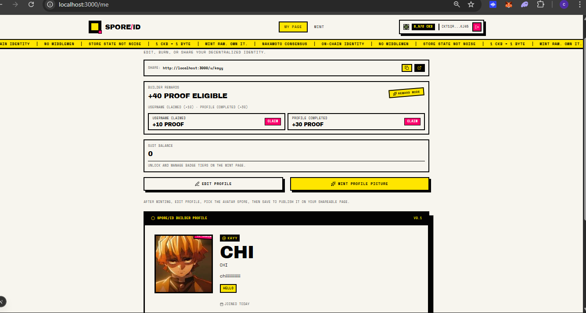
_My Builder Page right after setting up. SUDT balance shows 0, and I can see the Builder Rewards panel with +40 PROOF eligible -- +10 for claiming a username and +30 for completing a profile. The rewards haven't been claimed yet, so the token balance is still empty._

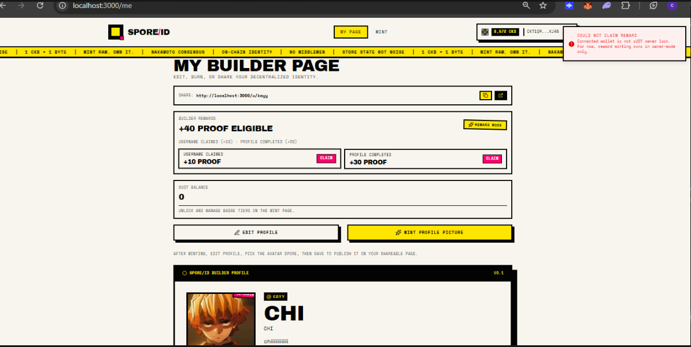
_I tried clicking Claim on the rewards and got an error: "Could not claim reward -- connected wallet is not UDT owner lock. For now, reward minting runs in owner-mode only." This was useful because it showed me exactly how SUDT minting permissions work in practice -- only the owner lock can mint. My wallet wasn't the owner, so the script rejected it._

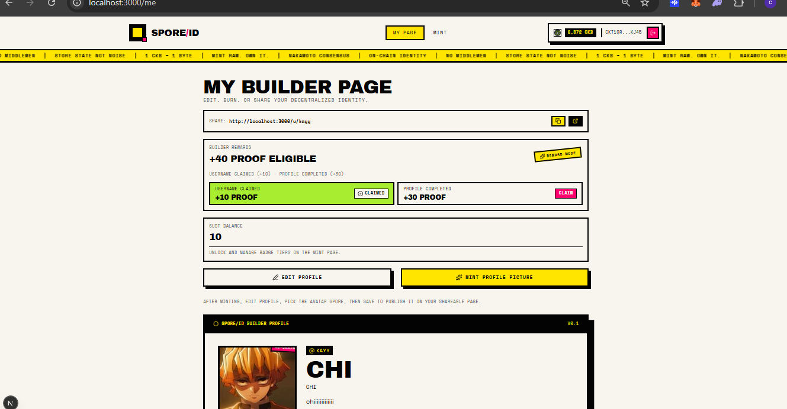
_After tokens were issued to my address - i switched my owner lock hash in the env so I could claim, my SUDT balance updated to 10. The +10 PROOF reward for claiming a username now shows as "CLAIMED". This is the moment the token cell arrived in my wallet -- a new SUDT cell was created with my lock script as owner._

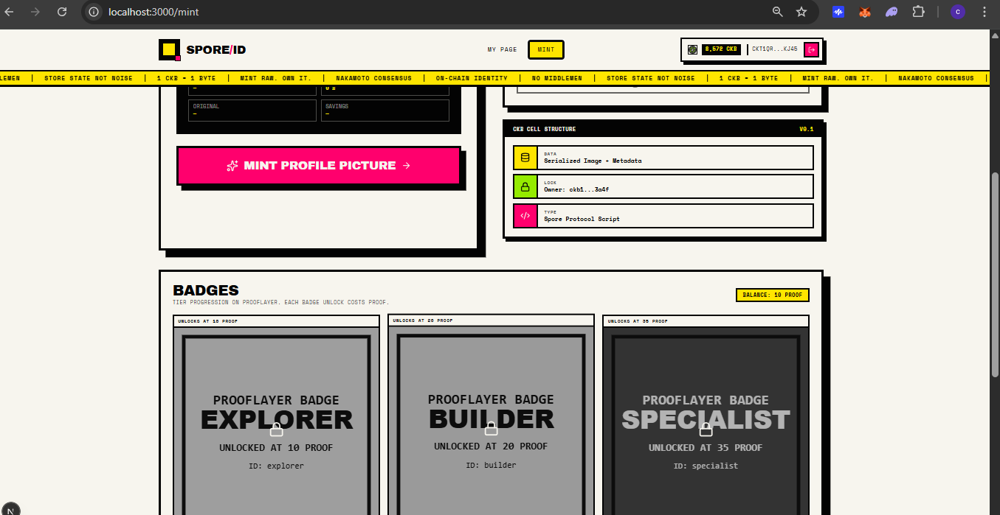
_The badge tiers are Explorer (10 PROOF), Builder (20 PROOF), and Specialist (35 PROOF). My balance is 10 PROOF, so Explorer is within reach._

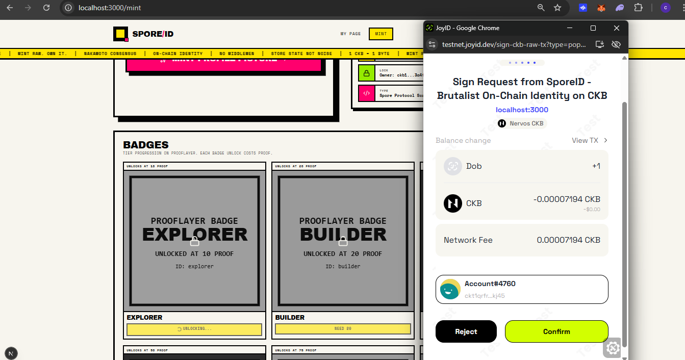
_JoyID signing popup for unlocking the Explorer badge. The transaction summary shows +1 DOB (a new on-chain asset being created) and a small network fee of 0.00007194 CKB. In the background the Explorer badge shows "Unlocking...". This is a real transaction submitting to Meepo testnet._

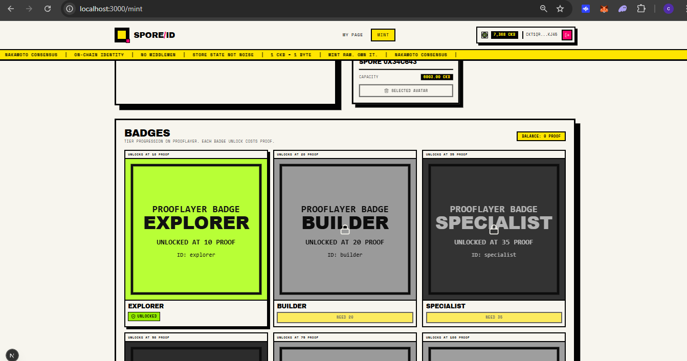
_After confirming the transaction, the Explorer badge is now highlighted in green and shows "UNLOCKED". Builder still needs 20 PROOF and Specialist needs 35. The CKB balance dropped slightly due to cell capacity reserved for the new badge cell (a DOB/Spore cell)._

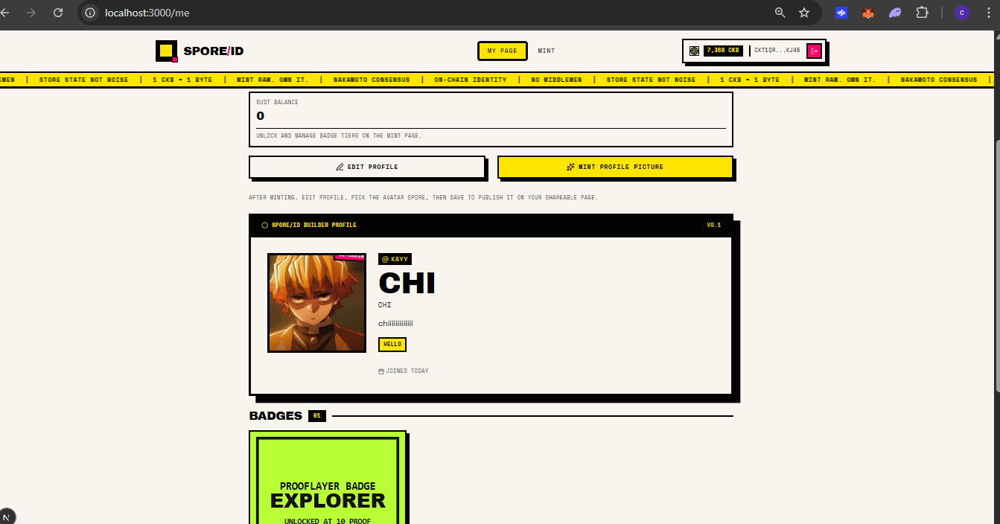
_Back on My Page, the profile card (@kayy / CHI) is live and the Badges section now shows 1 badge earned , the Explorer badge. The SUDT balance here shows 0 because the PROOF tokens were spent to unlock the badge (burned from the SUDT cell)._

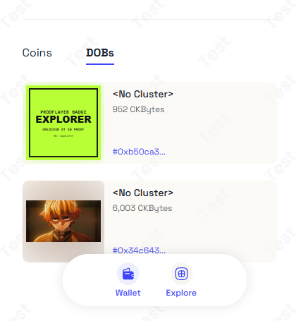
_JoyID wallet DOBs tab showing two on-chain assets: the Explorer badge cell (952 CKBytes, ID: 0xb50ca3...) and my profile picture Spore cell (6,003 CKBytes, ID: 0x34c643...). Both are live cells on-chain. This confirms that both the badge and the avatar exist as independent cells in my wallet._

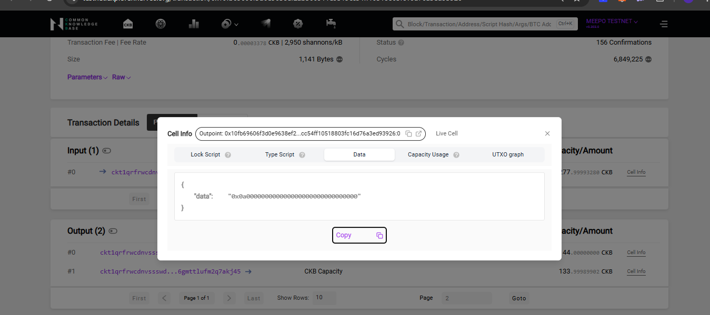
_CKB Explorer showing the raw data field of the SUDT cell: `0x0a000000000000000000000000000000`. This is 10 stored as a little-endian uint128 (0x0a = 10 in decimal). This is exactly what SUDT Rule 1 describes -- the first 16 bytes of cell data hold the token amount in little-endian format._

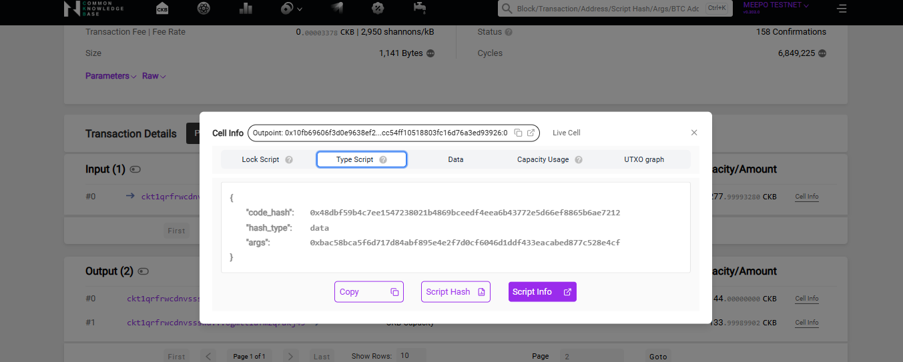
_CKB Explorer showing the Type Script tab of the same SUDT cell from image 09 -- the one holding 10 SUDT in its data field. The code_hash is the `simple_udt` script binary, hash_type is "data", and args holds the owner lock hash (the blake160 hash of the owner's lock script). This is exactly SUDT Rule 2 in practice: the first 32 bytes of the type script args identify who owns the token supply._

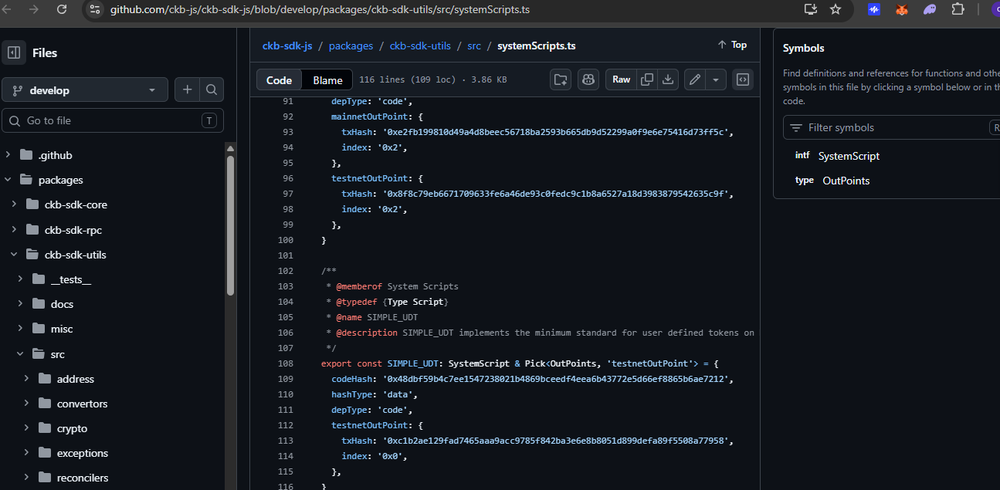
_This is where I pulled the `SIMPLE_UDT` script reference from during my practice session in the CKB SDK utilities package. It helped me confirm the system-script definition and the code hash I was using for the exercises._

#### Learning Notes: Simple UDT (SUDT)

This week gave me a much better mental model of fungible assets on CKB:

SUDT is not a balance table. It is a token standard built on Cells.

That means token actions are really cell actions:

- create token cells
- split token cells
- merge token cells
- burn token cells
- rebuild token cells in a new transaction

### What SUDT is

SUDT stands for Simple User Defined Token.

It is the standard fungible-token model on Nervos CKB, and it is intentionally minimal. The standard focuses on three things only:

- token storage format
- transfer validation
- mint authorization

Everything else is expected to come from custom lock scripts, composable scripts, or application-level logic.

### Why SUDT is a Type Script

SUDT is implemented as a Type Script, so it controls the token rules, not ownership.

That separation matters:

- Lock Script controls who can spend a cell
- Type Script controls what rules the cell must satisfy

So on CKB, ownership and token logic are separate concerns by design.

### Cell-based token mental model

CKB does not use an account-balance mapping like Ethereum.

There is no `mapping(address => balance)`.

Instead, tokens live inside Cells. A token cell usually contains:

- capacity in CKB
- a lock script
- a type script
- data that stores the token amount

Example shape:

```txt
Cell
├── Capacity: CKB
├── Lock Script
├── Type Script (SUDT)
└── Data: uint128 amount
```

### SUDT data and identity rules

The first 16 bytes of the cell data store the token amount as a little-endian `uint128`.

The token identity comes from the type script itself. Two SUDT cells are the same token only if their type scripts match, meaning the same:

- `code_hash`
- `hash_type`
- `args`

The first 32 bytes of the type script args are used for the owner lock hash. That owner identity is what gives the script governance authority.

### Transfer, mint, and burn

The core transfer rule is:

```txt
sum(input amounts) >= sum(output amounts)
```

The `>=` matters because burning is allowed. If the outputs are smaller than the inputs, the difference is destroyed.

Minting is allowed only when owner authority is present in the transaction inputs. The owner cell does not need to contain tokens; it only proves administrative authority.

### Why little endian and uint128 matter

`uint128` gives SUDT enough room for very large supplies.

Little endian means the least significant byte comes first. For example, `0x12345678` is stored as `78 56 34 12`.

### ACP and cheque as lock-script extensions

SUDT itself does not solve receiving UX, escrow, or timeout-based reclaim flows. That is why lock scripts like anyone-can-pay (ACP) and cheque are useful.

ACP lets someone append assets to a cell without the receiver signing every time. That makes deposit flows and wallet UX much smoother.

Cheque creates a temporary escrow-style flow where the receiver can claim first, but the sender can reclaim later after timeout if the receiver never acts.

### How this fits the CKB model

The biggest design insight for me is that CKB keeps the token logic minimal and pushes behavior into the lock script layer.

That makes SUDT useful for a lot of higher-level patterns without changing the token standard itself:

- escrow
- subscriptions
- vesting
- payment channels
- streaming payments
- DEX settlement
- bridges
- multisig treasuries

### My practical takeaway

CKB never mutates cells in place.

Transactions always consume old cells and create new ones, so the mental model is closer to state transition than account mutation.

That is the key difference from Ethereum-style thinking:

- Ethereum: update balances inside a contract
- CKB: consume cells and recreate new ones under script rules

### RFC-level summary

From the formal SUDT material, the important rules are:

- token amount lives in bytes 0-15 of cell data
- owner lock hash lives in bytes 0-31 of type script args
- identical type script means identical token
- input total must be greater than or equal to output total
- owner-authorized input is required for governance operations

### Deployment reference

The official SUDT script is deployed on Lina mainnet and Aggron testnet, with deployment metadata such as `code_hash`, `tx_hash`, `index`, and `dep_type` used to identify the on-chain script cell.

### Final summary

The most important thing I learned is that SUDT is intentionally minimal.

It only defines the token layer, while CKB cell composition handles everything else.

That is what makes the model powerful: token rules stay generic, and lock scripts provide the user experience.
