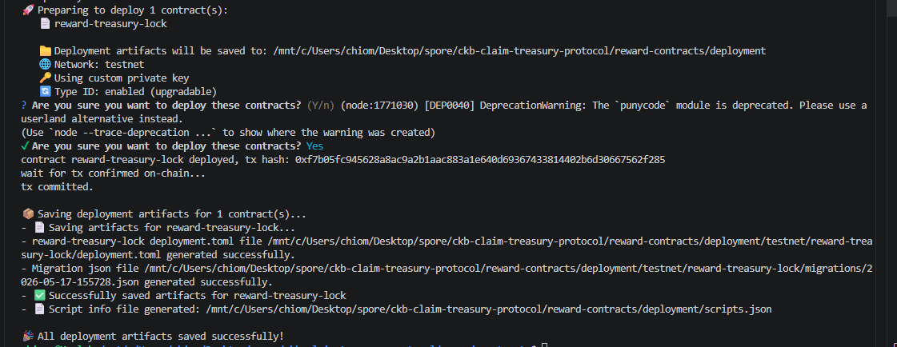
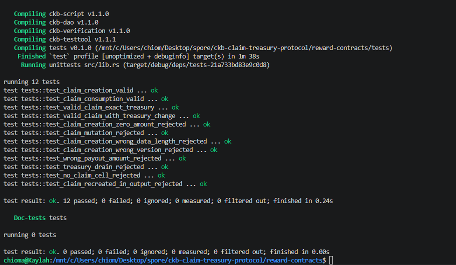
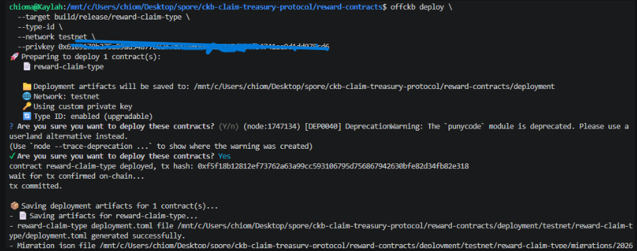

## CKB Builder Track Dev Log (Week 4)

- Name: Chioma Christopher
- Week Ending: 17-05-2026

#### What Was Shipped

Two linked Rust scripts that together form a reusable on-chain reward protocol:
- `reward-claim-type` (type script) --  validates claim cell lifecycle and prevents mutation
- `reward-treasury-lock` (lock script) -- enforces treasury payout rules and checks claim validity








These scripts enable any dApp to distribute tokens from a treasury cell only to users who hold valid claim cells, eliminating the need for owner-controlled minting or centralized validation.

#### The Two Scripts

##### `reward-claim-type` --  The Claim Ticket Script (Type Script)

This type script controls the lifecycle of claim cells. A claim cell encodes:

```
[version: 1 byte]
[recipient_lock_hash: 32 bytes]   ← who gets paid
[amount: 16 bytes u128 LE]        ← how much
[event_id_hash: 32 bytes]         ← which event triggered this reward
[nonce: 16 bytes]                 ← uniqueness / replay protection
```

**Total: 97 bytes**

The script enforces three rules:

| Scenario | Allowed? | Meaning |
|---|---|---|
| A new claim cell appears in outputs | Yes | Issuer is creating a valid ticket |
| A claim cell disappears from inputs | Yes | Holder is redeeming the ticket |
| A claim cell appears in both inputs AND outputs | No | Mutation forbidden --  claims are single-use |

Because it's a **type script**, it runs on both input and output sides of any transaction. This allows it to police creation, consumption, and reject any attempts to modify the claim.

##### `reward-treasury-lock` --  The Treasury Vault Script (Lock Script)

This lock script protects the treasury cell that holds the actual token supply (e.g., an sUDT cell).

The script is instantiated with a single argument: **the script hash of the official `reward-claim-type`**. This "seals" the treasury to only unlock for transactions carrying valid tickets.

**At runtime, the script enforces five checks:**

1. Its own args are exactly 32 bytes (a valid script hash)
2. At least one input has a type script whose hash matches `args` (authentic claim ticket present)
3. That claim cell does **not** reappear in outputs (cannot be spent twice)
4. Treasury math balances: `treasury_input_amount - treasury_output_amount == claim.amount`
5. An output cell pays exactly `claim.amount` tokens to `claim.recipient_lock_hash`

If all five pass, the treasury unlocks. If any fail, the transaction is rejected.

Because it's a **lock script**, it only runs on inputs. This is correct --  the lock controls *who* can spend the cell. In this case, "who" is any transaction that satisfies all five rules.

##### How They Link Together

The link is established **at deploy time**, not in code:

```
Step 1: Deploy reward-claim-type
        → Get type_id (e.g., 0x9c3081ef...)
        → Compute script hash of claim-type (e.g., 0x26743b63...)

Step 2: Deploy reward-treasury-lock
        → Binary has no args initially

Step 3: Create treasury cell
        → Set its lock script to reward-treasury-lock
        → Set lock args to the script hash from Step 1 (0x26743b63...)
```

This design allows:
- **Reusability**: The same treasury lock binary works with any claim-type, just change the args
- **Upgradeability**: Deploy a new claim-type with a new type_id, update treasury args to point to it
- **Immutability via type-id**: Using `--type-id` makes script upgrades non-destructive

#### Why This Design Solves the Reward Problem

The original challenge: projects using owner-controlled token systems (like Simple UDT) cannot let users mint tokens themselves. Only the token owner's wallet can trigger minting.

**The old approach failed** because:
- User attempts to claim reward → transaction tries to mint tokens directly
- sUDT script checks: "Is the transaction signer the owner?"
- User's wallet ≠ owner's wallet → transaction rejected on-chain

**The new approach works** because:
- No user ever mints directly
- Instead, issuer pre-funds a treasury cell with tokens
- User holds a claim cell (a ticket) that says "I am owed X tokens"
- User signs a transaction that consumes the ticket AND the treasury
- Both scripts run and verify:
  - `reward-claim-type` confirms the ticket is valid and wasn't mutated
  - `reward-treasury-lock` confirms the exact amount leaves treasury and goes to the ticket holder
- No direct minting needed --  just a cell state transition

#### How Frontends Will Use These Scripts

Any dApp integrating this protocol needs to:

**1. Issue a claim ticket (server-side or admin-controlled):**
```
Build a transaction with:
  outputs:
    - new claim cell
      lock: user's wallet lock (so only they can move it)
      type: reward-claim-type (with code_hash, hash_type, args)
      data: 97-byte ClaimData
```

**2. Let users redeem the ticket (user-side):**
```
Build a transaction with:
  inputs:
    - claim cell (type: reward-claim-type)
    - treasury cell (lock: reward-treasury-lock)
  outputs:
    - user's token cell (receives claim.amount)
    - treasury change cell (receives remainder, if any)
  cell_deps:
    - reward-claim-type script code
    - reward-treasury-lock script code
    - token type script code (e.g., sUDT)

User signs with their wallet
CKB validates:
  - reward-claim-type runs on claim input → passes (consumed, not mutated)
  - reward-treasury-lock runs on treasury input → all 5 checks pass
  - tokens transfer is valid
Transaction confirmed, user receives tokens
```

The scripts themselves don't care *why* a claim was issued or *what token* is being distributed. That's application logic. The scripts only enforce:
- Claims are single-use
- Treasury payouts match claim amounts
- Tokens go to the correct recipient

#### Deployment Artifacts

After deploying both scripts to testnet using `offckb deploy --type-id`:

```
reward-contracts/deployment/testnet/
  reward-claim-type/
    migrations/YYYY-MM-DD-HHMMSS.json    ← code_hash, type_id, tx_hash
  reward-treasury-lock/
    migrations/YYYY-MM-DD-HHMMSS.json    ← code_hash, type_id, tx_hash
  scripts.json                            ← quick reference
```

Key env vars extracted:

| Field | Env Var |
|---|---|
| claim-type code_hash | `NEXT_PUBLIC_REWARD_CLAIM_CODE_HASH` |
| claim-type type_id | `NEXT_PUBLIC_REWARD_CLAIM_TYPE_ARGS` |
| treasury-lock code_hash | `NEXT_PUBLIC_REWARD_TREASURY_LOCK_CODE_HASH` |
| treasury-lock type_id | `NEXT_PUBLIC_REWARD_TREASURY_BYTECODE_TX_HASH` |
| **Computed:** claim-type script hash | `NEXT_PUBLIC_REWARD_TREASURY_LOCK_ARGS` |

The last one is critical: after deploying both scripts, compute the full script hash of `reward-claim-type` and use it as the lock args when creating treasury cells.


#### What I Learnt This Week

- **On-chain minting constraints require architectural solutions.** When a token system has strict mint authority (like Simple UDT owner-only), the frontend cannot work around it. The entire flow must change. A treasury + claim-ticket model respects the chain's rules instead of fighting them.

- **Type scripts and lock scripts have distinct roles.** Type scripts validate state transitions (claim lifecycle). Lock scripts enforce authorization (who can unlock a cell). Mixing these concepts in one script or misplacing them creates confusion and bugs.

- **Linking scripts via args is flexible.** Storing one script's hash inside another script's args (not in code) allows the same binary to work with different configurations, supports upgrades, and keeps deployments clean.

- **Type-id deployments are worth the complexity.** Using `--type-id` ensures a script keeps the same identity even after code updates. This prevents needing to recreate all dependent cells and makes bug fixes non-destructive.

- **CKB-VM instruction compatibility must be checked during compilation.** A contract can pass local tests but fail on-chain if compiled instructions aren't VM-compatible (e.g., atomic instructions). Build flags matter.

- **Protocol-level scripts should be token/use-case agnostic.** These scripts don't care whether they're rewarding users, distributing airdrops, or validating grants. The protocol only enforces the invariants: claims are single-use, treasury balances match, payouts go to the right recipient.

#### State of the Scripts

| Component | Status |
|---|---|
| reward-claim-type script | Deployed to testnet |
| reward-treasury-lock script | Deployed to testnet |
| Script linking (args-based) | Verified |
| Type-id stability | Confirmed across updates |

#### My Short Summary

This week I shipped two linked scripts that form a reusable on-chain reward protocol: `reward-claim-type` (type script) validates claim tickets, and `reward-treasury-lock` (lock script) enforces treasury payouts. Together they enable any dApp to distribute tokens from a pre-funded treasury to users who hold valid claims, without requiring owner-controlled minting. The scripts are token-agnostic and can be integrated by any project needing verifiable, on-chain reward distribution. Both deployed successfully to testnet with type-id stability, meaning they can be upgraded without invalidating existing cells or breaking deployed integrations.