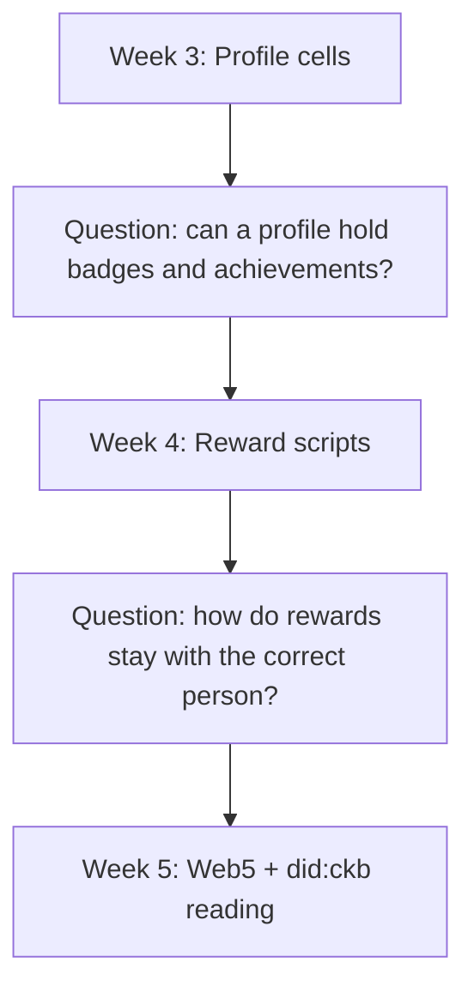
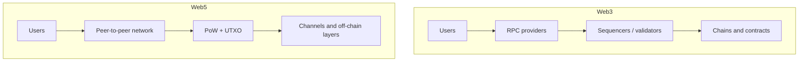
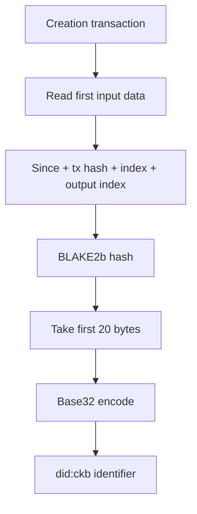
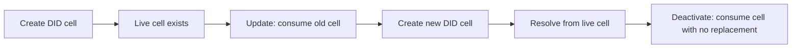

## CKB Builder Track Dev Log (Week 5)

- **Name:** Chioma Christopher
- **Week Ending:** 24-05-2026

#### What This Week Was

This was a research week. I did not ship new scripts.

I started from one big question: **Do the cells I see in my wallet really belong to me and can they live on and what happens if I loose this wallet sign in 🤔?**

That question came from my work on profile cells and reward scripts in Weeks 3 and 4. Back in Week 3, when I was building the profile system, I wanted to know how a profile cell could hold more than just a name or bio. I wanted it to hold badges and achievements, and I needed to figure out how those rewards actually stay attached to a person in a way the blockchain can prove.

🤔🤔 Is there a way that these rewards I earn can live on?

Reading the Web5 article helped me understand the bigger picture behind how ownership actually works.

#### What Web5 is trying to say

Web5 is not just a buzzword. The article uses it to describe a new way to build the internet where users talk directly to each other (peer-to-peer).

The main idea is that Web5 should be built on:

- Peer-to-peer networks
- Proof of Work (PoW) consensus
- UTXO-style data models (like CKB Cells)
- Channel networks and off-chain layers

This matters because the foundation you build on decides what kind of apps you can create.

#### The critique of Web3

The article points out that Web3 often fails to stay truly decentralized in the real world.

The reasons are built into the tech itself:

- Proof of Stake (PoS) makes it too easy to see who the main validators are.
- Account-based systems (like Ethereum) push user money into smart contracts, instead of letting users hold their own assets directly.
- The infrastructure ends up relying too heavily on centralized servers, like RPC providers and sequencers.

So the problem isn't just that people are greedy; the problem is the architecture.

#### Web3 vs Web5 Diagram

Code snippet

#### did:ckb Method Specification (WIP-01)

WIP-01 was the first document that made decentralized identity make sense to me on CKB.

#### What a DID is

A DID is a Decentralized Identifier. Instead of relying on a company to give you a username, the identifier belongs entirely to the person holding the keys.

The format looks like this: did:ckb:<identifier>

The best part is that the identifier is not just a random string of text. It is created directly from blockchain data.

#### How did:ckb creates identity

The unique identifier is created from pieces of the transaction that first made it:

- The first input's since field
- The first input's tx_hash (transaction hash)
- The first input's index
- The output index of the DID cell

These pieces are hashed together using BLAKE2b. The result is shortened and encoded as base32. This felt very familiar to me because it uses the exact same type-id pattern I used for my scripts in Week 4.

#### Identity Generation Diagram

Code snippet

#### What the DID cell contains

The DID Metadata Cell is just a normal CKB cell, but it holds:

- A lock script: This controls who can update the cell (Ownership).
- A type script: This checks if the update breaks any rules (Validation).
- Data: This stores the actual identity document.

Your identity isn't in a database; it is protected by the cell model itself.

The metadata inside can hold verification methods, other names you go by (alsoKnownAs), and links to services. This makes the identity flexible enough to use on many different apps.

#### Why the lifecycle matters

The lifecycle of a DID is exactly the same as the lifecycle of a CKB cell:

- Create: Make a new cell.
- Update: Destroy the old cell and make a new one in its place.
- Resolve: Read the data from the live cell.
- Deactivate: Destroy the cell without making a new one.

This splits the problem perfectly. The lock script handles the ownership, and the type script makes sure the rules are followed. They are separate, but they work together.

#### DID Lifecycle Diagram

Code snippet

#### The Rest of the Proposals (WIP-02 to WIP-05)

#### WIP-02 — did:ckb Method Local ID Extension

This proposal adds a "Local ID". It means your identity can start off-chain (like on a social network) and move to a full on-chain CKB identity later when you are ready to pay the storage cost. It also adds a 72-hour safety window so you can fix things if your keys get stolen during the move.

#### WIP-03 — did:ckb PDS Overview

This talks about the Personal Data Server (PDS). The server does the hard work of putting complex transactions together, but the user still has to sign it themselves. The server also handles tricky blockchain stuff like freezing cells while waiting for a transaction to finish. It proves that even when a server helps, the user is still in charge.

#### WIP-04 — did:ckb Nostr Document

This shows that did:ckb can easily plug into other social protocols like Nostr. You can add Nostr-specific details (like public keys and relays) without changing your base identity. One CKB identity can work everywhere.

#### WIP-05 — Client-Side Signing and Key Migration

This is all about keeping private keys on the user's device, never on a server. It explains how to safely use your main wallet to generate identity keys, so if you get a new phone or computer, your same wallet can recover your identity without exposing your main seed phrase.

#### Overall did:ckb Ecosystem Vision

After reading all five WIPs, I realized this is much bigger than just a new ID format.

The main goal is to build a universal identity layer where your identity is:

- Permanent on-chain
- Easy to move between apps (like CKB, Nostr, and AT Protocol)
- Protected entirely by your own keys

In simple terms: they are trying to turn identity into a portable asset that the user truly owns, which survives even if you rotate your main wallet.

#### What I Learnt This Week & Next Steps

- Real ownership comes from on-chain protocol rules and lock scripts, not from what an app's UI tells you.
- Identity can start off-chain and move on-chain later without breaking.
- Separating the key (lock script) from the identity (type script) is the secret to surviving wallet changes.

Next Steps: I want to explore what other knowledge gaps I need to cover so I can see what this app could potentially become.