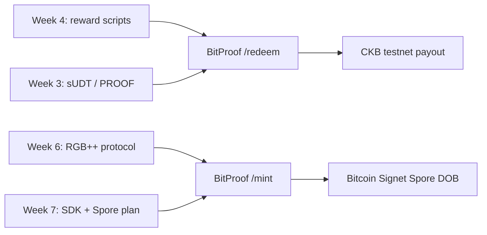

### CKB Builder Track Dev Log (Week 8)

- Name: Chioma Christopher
- Week Ending: 13-06-2026

### What This Week Was

Week 8 was my build week — executing the BitProof plan from Week 7.

After two research weeks (Week 6: RGB++ protocol, Week 7: Spore + SDK + app design), I shipped **BitProof**: a dual-chain achievement app connecting my Week 4 reward scripts on CKB with RGB++ Spore badges on Bitcoin Signet.

This addresses the handbook's **"create your own basic application"** task.

### What I Shipped

I scaffolded and ran **BitProof** locally at `apps/bitproof/`:

| Route | Purpose |
|-------|---------|
| `/` | Landing — dual-chain architecture overview |
| `/earn` | Three achievement tiers (Explorer / Builder / Architect) |
| `/redeem` | Claim cell scan + treasury redemption (or demo mode) |
| `/mint` | RGB++ badge minting after redeem |
| `/gallery` | View Bitcoin-backed DOBs via btc-assets-api |

**Stack:**

- Next.js + brutalist UI (same design language as SporeID)
- `@ckb-ccc/connector-react` for CKB wallet
- `@rgbpp-sdk/service` for btc-assets-api gallery integration
- Badge tiers linked to Week 4 `event_id_hash` values
- RGB++ setup guide at `scripts/bitproof-rgbpp/README.md`
- App README at `apps/bitproof/README.md`

`npm run build` passes — ready for Vercel deploy.

### Practice — Wallet Connected

_I connected my CKB wallet on localhost:3001. Balance shows testnet CKB. I walked through every page: Home, Earn, Redeem, Mint, Gallery._

_On `/earn` I see three badge tiers and PROOF costs (10 / 20 / 35). Each tier maps to an event ID hashed into claim cell data._

_On `/redeem` the app scans for claim cells when reward env vars are set. I used **Demo redeem** to unlock the mint flow while finishing env setup._

_On `/mint` I link a Bitcoin Signet address and select a tier. The preview shows JSON metadata for the RGB++ Spore._

_`/gallery` loads RGB++ assets from btc-assets-api after adding service token + BTC address._

<!-- Add when complete:

-->

### How BitProof Connects My Previous Weeks

### What I Learned Building

- RGB++ mint is a **pipeline**, not one button — virtual CKB tx → BTC commitment → queue service
- `@rgbpp-sdk/service` needs Signet token + matching `origin` (`http://localhost:3001` for local dev)
- CCC `signer.findCells()` filters by type script when scanning claim cells
- Event IDs (`bitproof_explorer_v1`, etc.) hash with blake2b into claim `event_id_hash`
- Demo redeem let me test UI before full treasury tx builder was ready

### Still In Progress

- [ ] `.env.local` with full Week 4 reward deployment values
- [ ] Signet btc-assets-api token in env
- [ ] Signet BTC from faucet
- [ ] RGB++ cluster setup (`scripts/bitproof-rgbpp/README.md`)
- [ ] First real Explorer badge mint on Signet
- [ ] BTC + CKB explorer tx hash screenshots
- [ ] Full on-chain treasury redeem (beyond demo mode)
- [ ] Deploy to Vercel

### Next Steps (Week 9)

1. Complete Signet cluster + first mint
2. Replace demo redeem with real claim cell flow
3. Deploy public demo URL
4. Discuss with Neon / DevRel for feedback and Spark/DAO pitch

### Personal Reflection

Week 7 gave me the checklist. Week 8 was running it — files, pages, wallet connect, build passing. Seeing my testnet balance in BitProof made the dual-chain design feel real. The remaining work is mostly Signet infrastructure, not unknown theory.
