## CKB Builder Track Dev Log (Week 9)

- Name: Chioma Christopher

- Week Ending: 20-06-2026

#### What I worked on

- Started **BitProof** -- earn PROOF on CKB via quests, mint RGB++ badge Spores on Bitcoin testnet, view in gallery.
- Simplified Week 8 into one flow: **Quests → Mint → Gallery** (removed `localStorage` state).
- Wired`claimRewardFromTreasury`, auto-issue claim tickets, and `/admin` treasury ops.

- Cloned `rgbpp-sdk`, built packages on Windows, ran cluster + spore scripts on **Bitcoin Testnet3** + `api.testnet.rgbpp.io`.
- Minted Explorer badge to my wallet `tb1qdrewnfzsgl83rmewseffmphrg680dj5laftx0d` and a demo wallet I tried first, In-app Mint button still returns instructions -- full wallet mint is Week 10.

## Practice

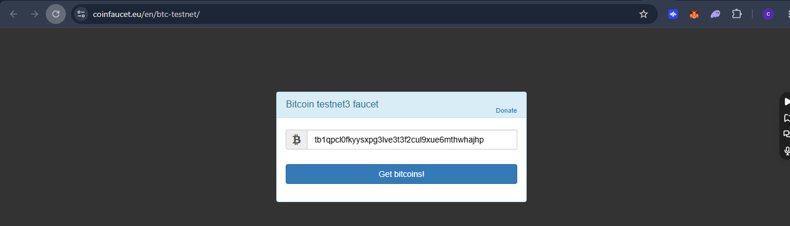
_Requested testnet BTC from coinfaucet.eu for the SDK signing wallet. RGB++ scripts need sats on Bitcoin testnet to pay transaction fees before cluster setup._

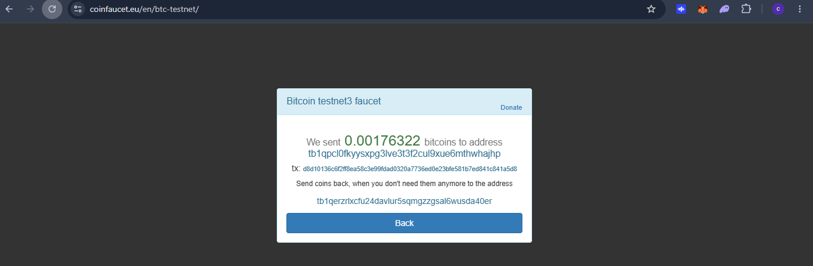
_Faucet confirmed 0.00176322 tBTC. This was the first step that proved my local RGB++ pipeline had real funding, not just env vars._

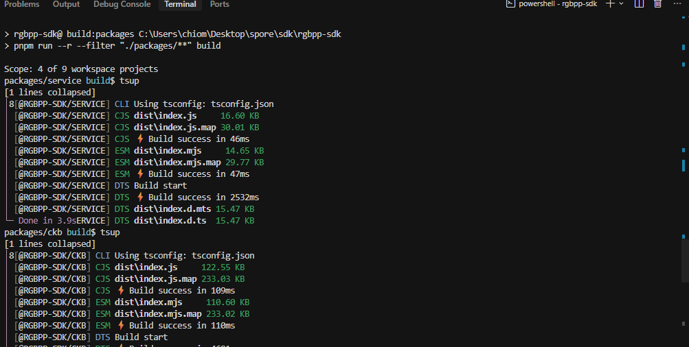
_Cloned `rgbpp-sdk` into `spore/sdk/` and ran `pnpm run build:packages`. All four workspace packages (`service`, `ckb`, `btc`, `rgbpp`) built successfully on Windows._

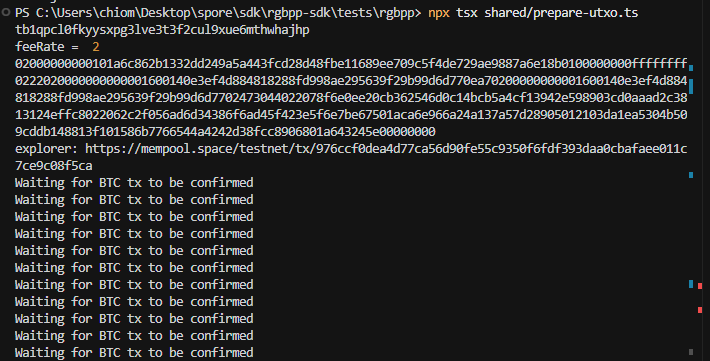
_Ran `npx tsx shared/prepare-utxo.ts` inside `tests/rgbpp`. The script broadcast a small Bitcoin testnet transaction to create an anchor UTXO for the RGB++ cluster._

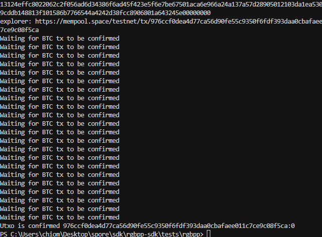
_The script polled until the UTXO confirmed (`976ccf0d…:0`). I had to wait here before `1-prepare-cluster.ts` -- same pattern as waiting for SPV proof later._

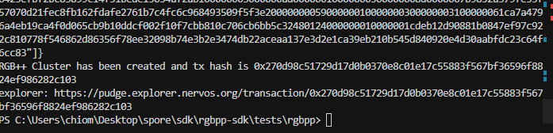
_`2-create-cluster.ts` finished. BitProof Badges cluster is live on CKB testnet -- tx `0x270d98c51729d17d0b0370e8c01e17c55883f567bf36596f8824ef986282c103`._

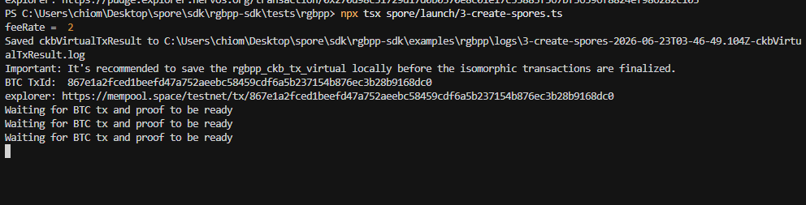
_`3-create-spores.ts` -- the SDK saves a CKB virtual tx, sends the BTC commitment, then loops on "Waiting for BTC tx and proof to be ready". This is the isomorphic cross-chain step._

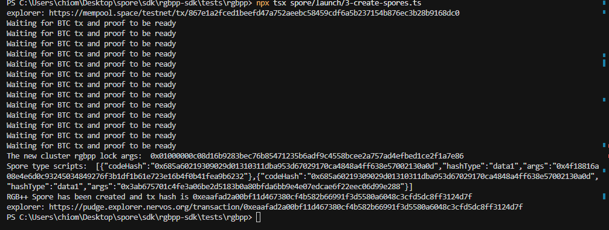
_First spore batch succeeded on CKB testnet -- tx `0xeaafad2a…`. Two demo spores went to the SDK example BTC address to prove the script path works._

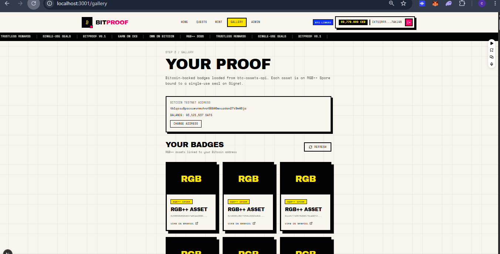
_BitProof `/gallery` with the SDK demo BTC address. Three RGB++ spores loaded from `api.testnet.rgbpp.io` -- this confirmed the gallery + service token + API wiring._

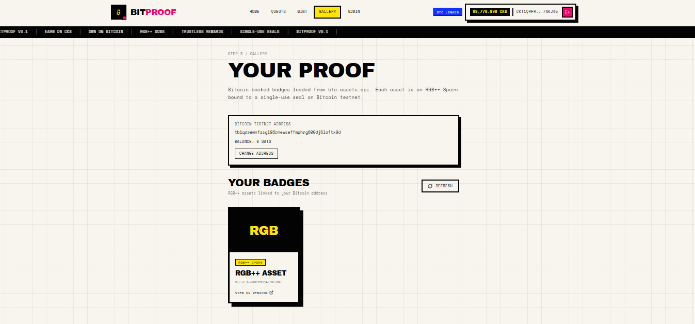
_Gallery after minting to my real wallet `tb1qdrewnfzsgl83rmewseffmphrg680dj5laftx0d`. One RGB++ spore shows for my address -- the Explorer badge I care about for the demo._

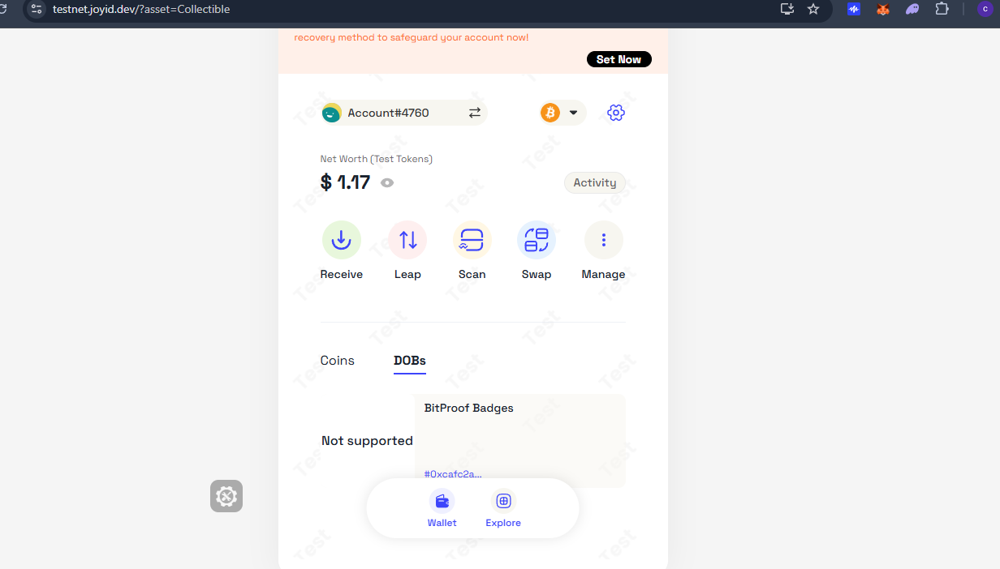
_JoyID testnet DOBs tab lists BitProof Badges (`0xcafc2ad9…`). The wallet renderer shows "Not supported" for custom DOB content, but the cell exists on-chain._

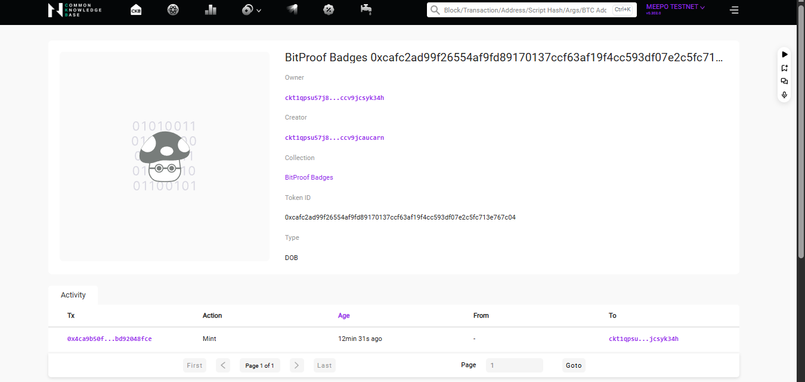
_Spore testnet explorer -- BitProof Badges collection with mint activity on tx `0x4ca9b50f…`. Spore ID `0xcafc2ad99f26554af9fd89170137ccf63af19f4cc593df07e2c5fc713e767c04`._

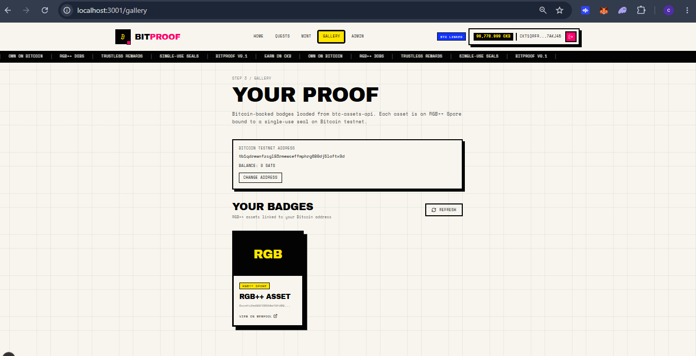
_Final BitProof gallery -- my BTC testnet address linked, CKB wallet connected, RGB++ asset card visible._

#### Learning Notes: BitProof + RGB++

This week connected two layers I had built separately: **CKB reward contracts** (Week 4) and **RGB++ Spores on Bitcoin** (ecosystem SDK).

### The app story

| Step    | Route      | What happens                                                               |
| ------- | ---------- | -------------------------------------------------------------------------- |
| Earn    | `/quests`  | Verify on-chain facts → claim ticket → claim PROOF from treasury           |
| Mint    | `/mint`    | PROOF balance unlocks badge tier (Explorer 10 / Builder 20 / Architect 35) |
| Gallery | `/gallery` | Paste `tb1q…` testnet address → load RGB++ spores from btc-assets-api      |

**PROOF** = fungible sUDT on CKB. **Badge** = RGB++ Spore on Bitcoin, ownership tied to a UTXO.

### Paste BTC address vs mint

Anyone can paste any `tb1q…` address on `/gallery` -- the app only **reads** public data from `api.testnet.rgbpp.io`.

Minting a spore requires **signing** Bitcoin transactions (fees, UTXO, commitment) and a matching CKB transaction after SPV proof. That is why Week 9 used `rgbpp-sdk` scripts with private keys in `.env`, and why the in-app Mint button only returns instructions today.

### RGB++ mint pipeline (what the scripts do)

1. Build CKB virtual transaction (cluster or spore).
2. Send BTC transaction with RGB++ commitment (OP_RETURN).
3. Wait for BTC confirmation + SPV proof from the service.
4. Finalize and submit CKB transaction.

Cluster lock args **change after every spore mint** -- I must update `NEXT_PUBLIC_RGBPP_CLUSTER_LOCK_ARGS` in `.env.local` before the next mint.

### On-chain references

- Cluster ID: `0x7b9852a379fe33f57070d21fec8fb162fdafe2761b7c4fc6c968493509f5f3e2`
- My Explorer spore CKB tx: `0x4ca9b50fab64eced1627a487f9a4bc8c4c5606482deef17bfc69a5bd92048fce`
- My BTC wallet: `tb1qdrewnfzsgl83rmewseffmphrg680dj5laftx0d`

### Week 10

- Wire Mint to UniSat / Xverse + rgbpp-sdk so users sign in-wallet (no manual `npx tsx`).
- Deploy BitProof to Vercel.
- Optional: burn PROOF on mint via `proof-burn-lock`.

### Final summary

Week 9 made BitProof have real PROOF claims on CKB, a live RGB++ cluster on testnet, and my own badge in gallery. The remaining gap is UX -- one-click mint in the browser -- and more protocol research as I had some issues with the recommended Signet flow.
